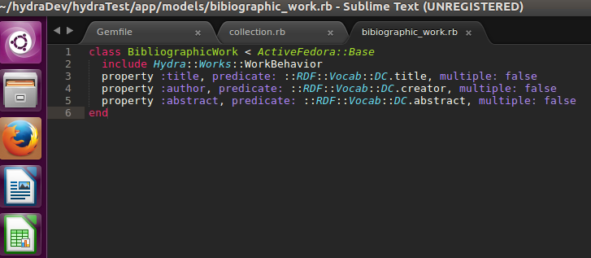
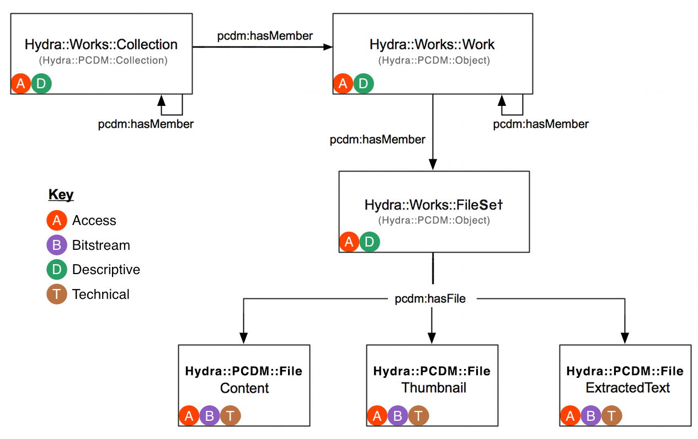

# University Archives in Practice at UAlbany

Gregory Wiedeman 
University Archivist

---

## Overview of University Archives

* University Records
	* Office of the President
	* University Senate
	* University Council
	* Office of the Provost
	* Graduate & Undergraduate Education
		* Records of Schools and Colleges
		* Records of Academic Departments
	* Web Archives
* Student Groups and Manuscripts
	* Student Association
	* Albany Student Press
	* Faculty and Alumni Papers

---

## SUNY Records Retention

* [SUNY Records Retention and Disposition Schedule](http://system.suny.edu/compliance/topics/records/records-retention/records-retention-schedule/ "SUNY Records Retention and Disposition Schedule")

* [University Archives](http://library.albany.edu/archive/ua)
* [Office of the Senior VP for Academic Affairs and Provost](http://meg.library.albany.edu:8080/archive/view?docId=ua500.xml)

University records are public records, subject to FOIL <!-- .element: class="fragment" data-fragment-index="1" -->

---

## Collecting Background

* Formal records management program until cut in 1990s
	* Very effective collecting in 1960s and 1970s
* Records Management "distributed" among offices
* Permanent Records should come to me
* Transfers used to happen during moves, when space needed
	* No longer sufficient
* Misunderstanding of archives and our role

---

## Arrangement and Description

* Mixed processing standards 
* Establishment of extensible processing practices
* Applying archival principles to resource management

---

## DACS in the University Archives

* [Describing Archives: A Content Standard](https://github.com/saa-ts-dacs/dacs)

* [New Draft DACS principles](https://docs.google.com/document/d/1aOV7IgH5WqVl-tXUswCJkZAML_A8SKjTZOB4_wGz35w/edit#heading=h.4b1ind7cr6ev)

---

## DACS Core Elements

	* Reference Code (Required)
	* Name and Location of Repository (Required)
	* Title (Required)
	* Date (Required)
	* Extent (Required)
	* Name of Creator(s) (Required)
	* Scope and Content (Required)
	* Conditions Governing Access (Required)
	* Languages and Scripts of the Material (Required)
	
	* Administrative/Biographical History (Optimum)
	* Access points (Optimum)

---

## DACS Added Value Elements

	* Finding Aids (Added Value)	
	* Custodial History (Added Value)
	* Immediate Source of Acquisition (Added Value)
	* Conditions Governing Reproduction and Use (Added Value)
	* System of Arrangement (Added Value)
	* Technical Access (Added Value)
	* Physical Access (Added Value)
	* Appraisal, Destruction, and Scheduling Information (Added Value)
	* Accruals (Added Value)
	* Publication Note (Added Value)
	* Notes (Added Value)
	* Description Control (Added Value)
	* Existence and Location of Originals (Added Value)
	* Existence and Location of Copies (Added Value)
	* Related Archival Materials (Added Value)

---

## Arrangement and Description

* Avoiding Arrangement
* Maintaining existing file series
	* Financial Secretary's Office
	* [Office of the Senior VP for Academic Affairs and Provost](http://meg.library.albany.edu:8080/archive/view?docId=ua500.xml)
* Also Artificial Collections
	* Yearbooks
	* General Reference Files

---

## Building a Modern Collecting Program

* Automated digital transfers
* Web crawling
* Disk imaging of external media
* Paper when maintained as such
* Format-neutral practices
* Requires digital infrastructure

---

## Born-Digital Records Collecting in Practice

* Files On the Live Web
	* Web crawling
* Files dispersed around the University
	* Local Computers
	* Network Shares
	* Cloud Storage
	* Different Software Applications

---

<!-- .slide: data-background="img-iipc/minutes.png" -->

---

<!-- .slide: data-background="img-iipc/undergradBulletin.png" -->

---

<!-- .slide: data-background="img/applications1.png" -->

---

<!-- .slide: data-background="img/applications2.png" -->

---

#### [Ben Goldman, "Outfitting a Born-Digital Archives Program" <i>Practical Technology for Archives</i>&nbsp;&nbsp; Issue 2 (June 2014)](http://https://practicaltechnologyforarchives.org/issue2_goldman/)

<!-- .slide: data-background="img/diskImaging.jpg" -->

---

<!-- .slide: data-background="img/oais.png" -->

---

<!-- .slide: data-background="img/transferShares.png" -->

---

## Transfer Scripts

* Network Folder Share
	* Archives and creator has access
* Python script run on task scheduler
* Weekly checks for new files
* CSV log files of files transferred
* Creates XML accession metadata file
* Runs createSIP.py command line tool

---

## Bag-it

* [What our bags currently look like](\\romeo\SPE)
* [Bag-it Profiles](https://github.com/ruebot/bagit-profiles)

---

## Maintenance

* Scripts break over time
	* No more ad-hoc approaches
	* No more XML data stores
* Network of well-maintained interoperable tools
* ArchivesSpace Migration

---

## Building Digital Infrastructure

<!-- .slide: data-background="img/systemDesign.jpg" -->

---

## Connections through APIs

* [Archive-It API](http://wayback.archive-it.org/3308/timemap/cdx?url=http://www.albany.edu/undergraduate_bulletin/)
* [Wayback Machine API](https://web.archive.org/cdx/search/cdx?url=http://www.albany.edu/undergraduate_bulletin/)
* [ArchivesSpace](http://169.226.92.31:8080)
* [ArchivesSpace API](https://archivesspace.github.io/archivesspace/api/)

	python
	from archives_tools import aspace as AS
	session = AS.getSession()
	for collection in AS.getResources(session, "2", "all"):
		if "ua" in collection.id_0:
			print collection.title

	for collection in AS.getResources(session, "2", "all"):
		if "Baldus" in collection.title:
			for note in collection.notes:
				if note.type == "abstract":
					AS.pp(note)

---

## Espy Project: Building an Open Digital Repository

* [CLIR-funded grant project to digitize Espy Papers](http://library.albany.edu/archive/espyproject)
* Make data publicly available for computational research
* [Espy Metadata Creation Tool](http://169.226.92.29/)

---

### Fedora 4 Data Model

---

## Portland Common Data Model

---

## Hydra::Works

---

## Open, Interconnected Workflows

1. Detect accession
2. Get contextual data from ArchivesSpace API
4. Ingest into digital repository
5. Que for review 
6. Expose data into central search index

---

## Central Search index

* [Our Current Search](http://library.albany.edu/archive/)
* [NC State QuickSearch](https://historicalstate.lib.ncsu.edu/search/?q=war)

---

## Other Projects

* [Project Electron at Rockefeller Archive](http://projectelectron.rockarch.org/)
* [ArcLight Demo](https://arclight-demo.projectblacklight.org/)
* [ArcLight Project Docs](https://wiki.duraspace.org/display/hydra/ArcLight+Design+Documents)
* [ArcLight Github](https://github.com/sul-dlss/arclight)
* [WarcLight Demo](http://warclight.archivesunleashed.org/)
* [WarcLight Github](https://github.com/archivesunleashed/warclight)

---

## Questions