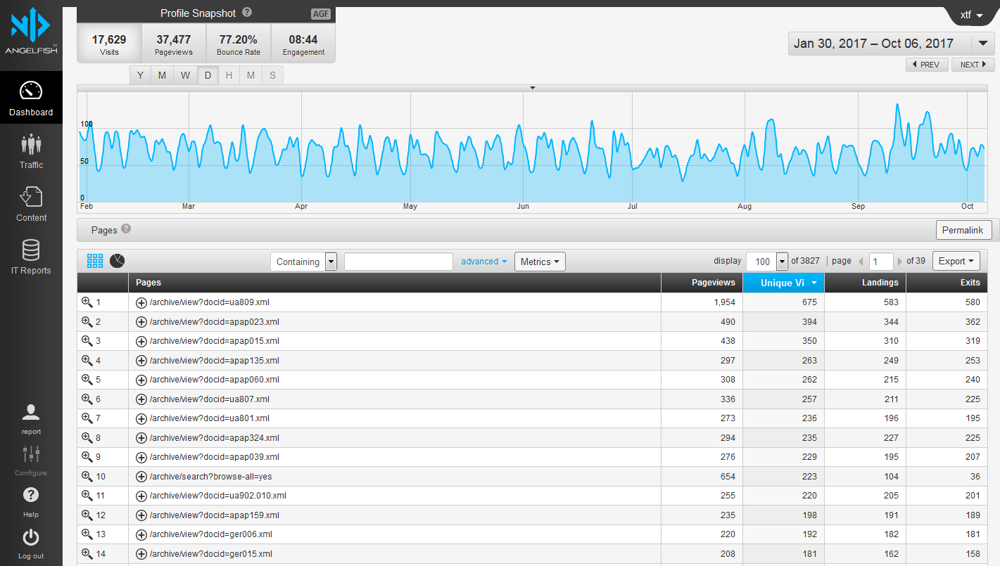

## Description and Access in the University Archives

Gregory Wiedeman 
University Archivist

---

* Overview of the Department
* About the University Archives
* Collecting Public Records
    * Discussion
* DACS
* Description Exercise
* University Archives Extensible Processing
    * Discussion
* How Description enables Access
* Espy Project
* Stacks tour and discussion

---

## M.E. Grenander Department of Special Collections & Archives

* Collects unique records of enduring value
* Provide access and encourage use

---

## Collecting Areas and Department History

* University Archives
* ["Business, Literary, and Miscellaneous Manuscripts"](https://library.albany.edu/speccoll/findaids/eresources/static/mss.html)
* Rare Books
    * Mathes Childrens Literature Collection
* German and Jewish Intellectual Émigré
* Modern Political Archives
* National Death Penalty Archives

---

## About us

5 archivists
* Brian Keough, Head Archivist
* Jodi Boyle, Supervisory Archivist
* Melissa McMullen, Project Archivist
* Mark Wolfe, Curator of Digital Collections
* Gregory Wiedeman, University Archivist
* David Mitchell, Mathes Curator
* 7-10 Student Assistants

---

## [The University Archives](https://library.albany.edu/archive/ua)

* University Records
	* Office of the President
	* University Senate & Council
	* Provost, Academic Administration
    * Centers & Institutes
    * Reference Collections
	* Web Archives
* Student Groups and Manuscripts
	* Student Association
	* Albany Student Press
	* Faculty and Alumni Papers

---

## Collecting Background

* Formal records management program until cut in 1990s
	* Very effective collecting in 1960s and 1970s
* Records Management "distributed" among offices
* Most permanent records should come to me
* Transfers used to happen during moves, when space needed
	* No longer sufficient
* Misunderstanding of archives and our role

---

## SUNY Records Retention

* [SUNY Records Retention and Disposition Schedule](http://system.suny.edu/compliance/topics/records/records-retention/records-retention-schedule/ "SUNY Records Retention and Disposition Schedule")

* [Office of the Senior VP for Academic Affairs and Provost](http://meg.library.albany.edu:8080/archive/view?docId=ua500.xml)

University records are public records, subject to FOIL <!-- .element: class="fragment" data-fragment-index="1" -->

---

## Records Collecting in Practice

* Files dispersed around the University
    * Boxes and filing cabinets in storage areas
	* Local Computers
	* Network Shares
	* Cloud Storage
	* Different Software Applications
* Files On the Live Web
	* Web crawling

---

## Prioritizing Born-Digital

* Advantages
    * The master copy in most cases, often only copy
    * Easier to provide access
    * Often comes with more useful creator metadata
    
* Disadvantages
    * Few immediate reasons to manage or transfer
    * Requires long term institutional commitment
    * Cost to develop and implement systems
    * Cost to maintain systems
    
---

<!-- .slide: data-background="img-iipc/minutes.png" -->

---

<!-- .slide: data-background="img-iipc/undergradBulletin.png" -->

---

<!-- .slide: data-background="img/applications1.png" -->

---

<!-- .slide: data-background="img/applications2.png" -->

---

#### [Ben Goldman, "Outfitting a Born-Digital Archives Program" <i>Practical Technology for Archives</i>&nbsp;&nbsp; Issue 2 (June 2014)](http://https://practicaltechnologyforarchives.org/issue2_goldman/)

<!-- .slide: data-background="img/diskImaging.jpg" -->

---

## Building an Institutional Records Collecting Program

* Avoid unsoliticed donations
* Systematic application of the retention schedule 
    * applied to each department
* Format-neutral practices
* Requires digital infrastructure

---

## How do you collect records?

* Automated digital transfers
    * Authentication is biggest barrier
* Web crawling
* Paper when maintained as such
    * Imaging disks in boxes

---

<!-- .slide: data-background="img/transferShares.png" -->

---

## Transfer Scripts

* Network Folder Share
	* Archives and creator has access
* Python script run on task scheduler
* Weekly checks for new files
* CSV log files of files transferred
* Creates XML accession metadata file
* Runs createSIP.py command line tool

---

## Bag-it

* [What our bags currently look like](\\Romeo\SPE\ua200-7VsAhYXbfYg3EKXaypCJeD)
* [Bag-it Profiles](https://github.com/ruebot/bagit-profiles)

---

## Maintenance

* Scripts break over time
	* No more ad-hoc approaches
	* No more XML data stores
* Network of well-maintained interoperable tools
* ArchivesSpace Migration

---

## Building Digital Infrastructure

<!-- .slide: data-background="img/systemDesign.jpg" -->

---

## Connections through APIs

* [Archive-It API](http://wayback.archive-it.org/3308/timemap/cdx?url=http://www.albany.edu/undergraduate_bulletin/)
* [Wayback Machine API](https://web.archive.org/cdx/search/cdx?url=http://www.albany.edu/undergraduate_bulletin/)
* [ArchivesSpace](http://169.226.92.31:8080)
* [ArchivesSpace API](https://archivesspace.github.io/archivesspace/api/)

	python
	from archives_tools import aspace as AS
	session = AS.getSession()
	for collection in AS.getResources(session, "2", "all"):
		if "ua" in collection.id_0:
			print collection.title

	for collection in AS.getResources(session, "2", "all"):
		if "Baldus" in collection.title:
			for note in collection.notes:
				if note.type == "abstract":
					AS.pp(note)

---

## APIs help enable maintainable workflows

* Allows Separation of concern
    * No huge all-inclusive systems
* [Find-it](http://libstaff/find-it/)
                    
---

## Tools for Transferring/Accessioning

* [Archivematica](https://www.archivematica.org/en/)
* [Preservica](https://preservica.com/)
* [Aurora](https://github.com/RockefellerArchiveCenter/aurora)
* [BitCurator tools](https://bitcurator.net/)
                    
---

## Open, Interconnected Workflows

1. Detect a new accession
2. Post accession record to ArchivesSpace API
3. Ingest into digital repository
    * Backed by a data model
4. Que for review
5. Extract existing metadata during description
6. Post description to ArchivesSpace API
7. Export data to public access system

---

## Data Modeling

---

## Data Modeling in Archives

* [ArchivesSpace Models](https://github.com/archivesspace-labs/ArchivesSnake/wiki/Commonly-Used-Objects)
* [Data Modeling for Aurora](http://blog.rockarch.org/?p=1969)

---

* Our Department
    * Collecting Areas
    * Staffing
* University Archives
* Public Records
* Collecting Digital Records
* Data Modeling

---

## Focus on the challenging work, automate the busywork

Not all can or should be automated

* Description is important and time consuming
* Managing restrictions and privacy

---

## DACS

[Describing Archives: A Content Standard](https://github.com/saa-ts-dacs/dacs)

* Information Systems Standards (EAD, ASpace)
* Data Structure Standards (EAD)
* Data Content Standards (DACS)
* Data Values Standards (LCSH, AAT)

* ISAD(G), ISAAR(CPF) --> RiC?

---

### Old Priciples, 1-6

1. Records in archives possess unique characteristics
2. The principle of respect des fonds is the basis of archival arrangement and description
3. Arrangement involves the identification of groupings within the material
4. Description reflects arrangement
5. The rules of description apply to all archival materials, regardless of form or medium
6. The principles of archival description apply equally to records created by corporate bodies, individuals, or families

---

### Old Princples, 7-8

* (7) Archival descriptions may be presented at varying levels of detail to produce a variety of outputs
    * Levels of description correspond to levels of arrangement.
    * Relationships between levels of description must be clearly indicated.
    * Information provided at each level of description must be appropriate to that level.
* (8) The creators of archival materials, as well as the materials themselves, must be described.
    
---

### Revised Principles, 1-4
    
1. Archival description expresses professional ethics and values
2. Users are the fundamental reason for archival description
3. Archival description must be clear about what archivists know, what they don’t know, and how they know it.

---

Records, agents, events, and the relationships between them are the four fundamental concepts that constitute archival description.

* Records must be described in aggregate and may be described in parts.
* The relationships among records, agents, and events are essential to understanding archives and must be described. 
* Record creators and other agents must be described sufficiently to fully understand the meaning of records.
* Events that are essential to understanding records must be described. 

---

### Revised Principles, 5-7

* (5) Archival description privileges intellectual content in context. Descriptive rules apply equally to all records, regardless of format or carrier type. 
* (6) Each collection within a repository must have an archival description.
* (7) Archivists must have a user-driven reason to enhance existing archival description. 

---

### Revised Principles, 8-11

* (8) Archival description should be easy to use, re-use, and share.
* (9) Archival description is accessible and intelligible.
* (10) Archivists must document and make discoverable the actions they take on records.
* (11) Archival description is a continuous intellectual endeavor.
    
---

## DACS Core Elements

	* Reference Code (Required)
	* Name and Location of Repository (Required)
	* Title (Required)
	* Date (Required)
	* Extent (Required)
	* Name of Creator(s) (Required)
	* Scope and Content (Required)
	* Conditions Governing Access (Required)
	* Languages and Scripts of the Material (Required)
	
	* Administrative/Biographical History (Optimum)
	* Access points (Optimum)

---

## DACS Added Value Elements

	* Finding Aids (Added Value)	
	* Custodial History (Added Value)
	* Immediate Source of Acquisition (Added Value)
	* Conditions Governing Reproduction and Use (Added Value)
	* System of Arrangement (Added Value)
	* Technical Access (Added Value)
	* Physical Access (Added Value)
	* Appraisal, Destruction, and Scheduling Information (Added Value)
	* Accruals (Added Value)
	* Publication Note (Added Value)
	* Notes (Added Value)
	* Description Control (Added Value)
	* Existence and Location of Originals (Added Value)
	* Existence and Location of Copies (Added Value)
	* Related Archival Materials (Added Value)

---

## DACS Principles revision

What do you think?

---

## Description Exercise

* Groups of 2-3
* Apply DACS to your collection
* Read desciption from another group

---

## Extensible Processing in the University Archives

* No Detailed Processing vs. Minimal Processing/MPLP
* Creative approaches to scale are fundamental to archives
* We will never have enough resources
* Late 20th century records are very stable
* Processing is Resource Management

---

## Handling Scale with our Principles

* Establishing baseline processing for everything
* User-based reason for adding additional description
    * Request statistics
    * Web usage statistics
    * Immediate demand
    * Direct request

---

---

---

## [Yearbook Collection](https://meg.library.albany.edu:8443/archive/view?docId=ua807.xml)

* No description until 2015
* Second most visited collection page
* Most requested for digitization

---

## Don't describe containers

* Users don't care what box its in
* Maureen Callahan, "On Containers"
* [https://icantiemyownshoes.wordpress.com/2014/12/15/on-containers/](https://icantiemyownshoes.wordpress.com/2014/12/15/on-containers/)

---

## [General Reference Collection](https://meg.library.albany.edu:8443/archive/view?docId=ua950.002.xml)

* Order/Context is lost
* Will always have additions
* Discovered more records after description
* Don't have time to interfile

---

## [Provost's Office Records](https://meg.library.albany.edu:8443/archive/view?docId=ua500.xml)

* Only preserve permanent records
* Bulletins are used often
    * Item-level
* Program Registration Letters
    * Item-level
* Program Registration Letters
    * Described as found
    * Ordered description not files
    * Restricted pending review

---

## [Division of Research Records](https://meg.library.albany.edu:8443/archive/view?docId=ua400.xml)

* No real accssion records
* Dates on boxes
* Describe records as found
* No refoldering unless neccessary
* Can now describe [International Programs](https://meg.library.albany.edu:8443/archive/view?docId=ua550.xml)

---

## Digitization on Demand

Users don't want help finding thigs, they want help getting things

* Empower users to make requests
* Appraisal by direct use
* Use cheap digitization methods
    * Sheet feeders!
* [Connect digital objects with description](http://169.226.92.29:8080/users/sign_in?locale=en)
    * Metadata is most costly part of digitization

---

## Extensible Processing

* Establish minimum level for all collections
* User-based reasons to add description
* Avoid arrangement
* Avoid granular preservation interventions is most cases
* Don't describe containers
* Make the robots do the work

What do you think?

---

## Effective Description enables Access

* Nothing is discoverable without metadata
* We spend a lot of resources on description
    * Let people use it!

---

## User Experience (UX) Design

* There is no average user
* Make sure everyone can use our systems easily
* "Discount" or "guerilla" usability testing
* Test early, test often
* Steven Krug, Don't Make Me Think

---

## User Testing on a Budget

* Offer incentive!
* Use the "think aloud" method
* Observe
    * What do they expect?
    * Where are they frustrated?
* Consider a brief follow-up survey or before/after survey
* Even 3-5 people is great
* Resources: [http://bit.ly/archiveusabilityresources](http://bit.ly/archiveusabilityresources)

---

## Using Description for Context

* Bearman & Lytle, "The Power of Provenance"
* [Arclight](http://169.226.92.29)
* [Hyrax](http://169.226.92.29:8080)
* [Bento Search](http://169.226.92.29:8000)

---

---

## Espy Project

* M. Watt Espy collected documentation on American executions 1608-2002
* Index card summaries, 46 cu. ft. copies of original and published source material
* 1980s NSF grant to create [“The Espy File”](https://www.icpsr.umich.edu/icpsrweb/NACJD/studies/23900) now in ICPSR
* [CLIR-funded grant project to digitize Espy Papers](http://library.albany.edu/archive/espyproject)
* Make data publicly available for computational research

---

## Espy Project

* [Espy Metadata Creation Tool](http://169.226.92.29:8081/)
* Challenges of Linked Data

---

## Exposing Data in Context

<ul>

</ul>

---

### Does Linked Data align with the Archival Mission?

* Archives use context to efficiently provide access to unique material at scale
* Researchers will not use SPARQL to access this data
* In practice, do URIs provide or obscure context?
* Does a Linked Data URI convey false objectivity or false authority?
* Does this scale?

As we start seeing archival collections themselves as data, Linked Data may not be a good fit

---

* Overview of the Department
* About the University Archives
* Collecting Public Records
    * Discussion
* DACS
* Description Exercise
* University Archives Extensible Processing
    * Discussion
* How Description enables Access
* Espy Project
* Stacks tour and discussion

