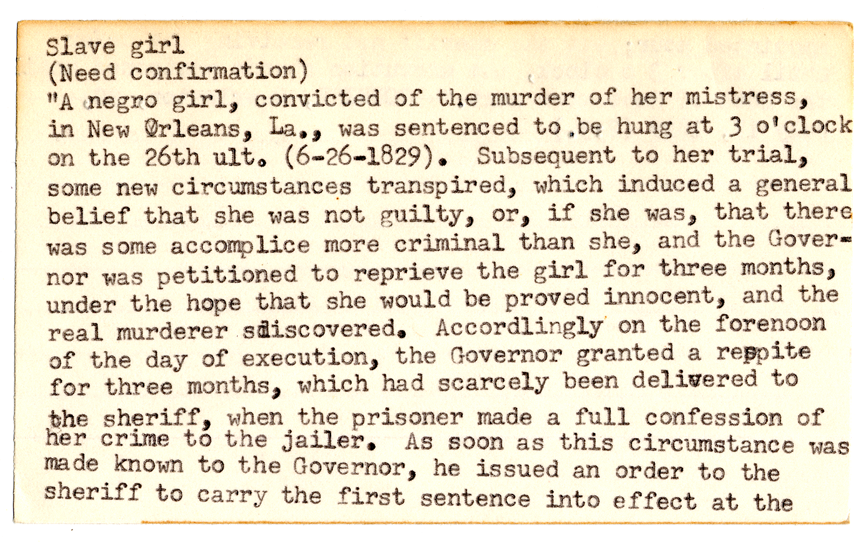
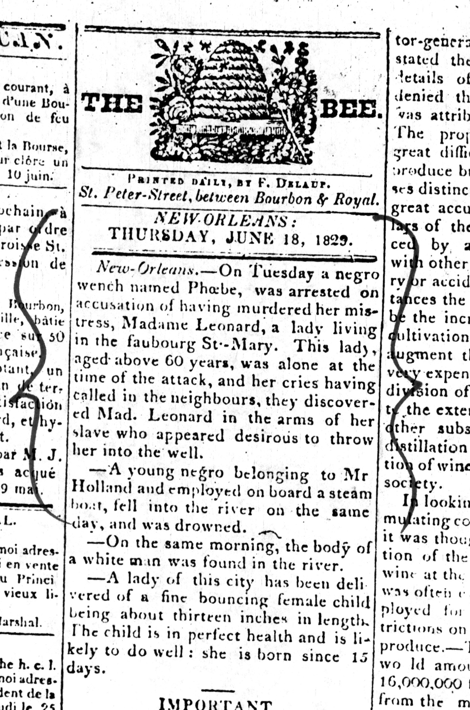
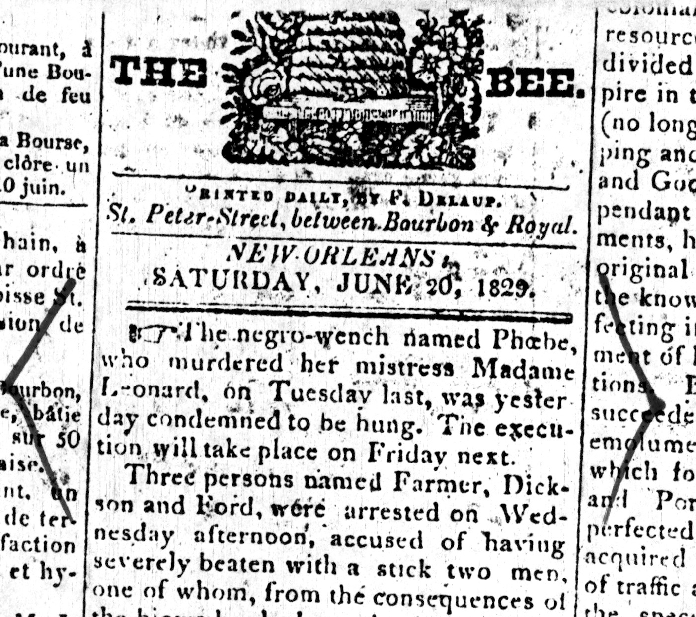

### Providing Computational Access to Records of American Capital Punishment
 
##### Gregory Wiedeman
##### University Archivist
##### University at Albany, SUNY
#####  @GregWiedeman

---

### National Death Penalty Archive

UAlbany collects records from researchers, writers, and activists related to capital punishment in the United States as part of the <a href="https://archives.albany.edu/static/91.html">National Death Penalty Archive</a>.

---

Watt Espy Papers: The most complete set of extant records of American executions.
<ul>
 
<li>24,036 sides of index cards</li>
<li>A 101,566 pages of reference materials
<ul>
<li>Copies of Correctional Records</li>
<li>Copies of newspapers and published sources</li>
<li>Written notes</li>
</ul>
</li>
</ul>

	

---

<!-- .slide: data-background="https://library.albany.edu/sites/all/themes/New_UArchives/img/1900/ndpa1.jpg" alt="Test" -->

Image of Index card summaries of executions.

---

### The ESPY File

* <a href="https://www.icpsr.umich.edu/icpsrweb/NACJD/studies/8451/summary">NSF-funded project</a> in 1984 to create a dataset from the collection.
    * "The most often cited and used list of America’s legal executions"
* Researchers have traveled to view discrepancies with the source material
* Paul H. Blackman and Vance McLaughlin, <a href="https://doi.org/10.1177/1088767911418054">The Espy File on American Executions: User Beware</a> (2011)

---

#### Computational Analysis and the Death Penalty

* <i>Furman v. Georgia</i> (1972)
* <i>Gregg v. Georgia</i>, etc. (1976)
* Marvin Wolfgang and Marc Riedel Study (1973) and <i>Maxwell v. Bishop</i>
* David Baldus-led Georgia Study
* <i>McCleskey v. Kemp </i> (1987)
	* Found "racially disproportionate impact"
	* invalidated statistical analysis for 14th amendment claims
* <i>Miller-El v. Dretke</i> (2005)
    * Utilized statistical analysis for <i>Batson</i> challenge

---

### <a href="http://registry.clir.org/projects/23081088">The Digital Archive of Executions in the United States, 1608-2002</a>

<ul>
<li>CLIR-funded digitization project</li>
<li>Provide context to data points</li>
<li>API access to underlying data</li>
</ul>

---

### The "We"

* 3 archivists
    * Mark Wolfe
    * Melissa McMullen
    * me
* Partial support from Library Systems Staff
    * Department Head
    * Systems Administrator
    * Web Developer
    * Database Administrator

---

### Espy Metadata Creation Tool

* Samvera and Hyrax is Rails application
* "Ramp up" plan for repository implementation and maintenance
* Makes connections between 4 difference sources
	* Small Index Cards
	* Large Index Cards
	* Reference Material
	* Espy File data
* Create new Espy Records backed by Data Model
* Make the computer do the boring work
* Focus on intellectual process of metadata creation

---

<!-- .slide: data-background="img/espy1.png" -->

---

<!-- .slide: data-background="img/espy3.png" -->

---

<h4>Metadata Matters</h4>
<ul>
<li>Espy File data demonstrated creators’ 
priorities, values, and mental framing 
that are inappropriate or conflict with 
our own</li>
<li>Occupation:
<ul>
<li>"Student"</li>
<li>"Banana Dealer"</li>
<li>"Beef Carrier"</li>
<li>"Goat Herder"</li>
<li>"Tiecutter"</li>
<li>"Tourist"</li>
</ul>
</li>
</ul>

	

---

<h4>Metadata Matters</h4>
<ul>
<li>Occupation:
<ul>
<li>"Armed robber"</li>
<li>"Asylum Escapee"</li>
<li>"Bandit"</li>
<li>"Criminal"</li>
<li>"Cult Leader"</li>
<li>"Gang Member"</li>
<li>"Lunatic"</li>
<li>"Male Nurse"</li>
<li>"Retarded"</li>
<li>"Slave"</li>
</ul>
</li>
</ul>

	

---

### Metadata Matters

* "Crime Committed" changed to "Crime Convicted"
* Race does not conform to an established standard
* General Data Improvements
	* Added Date of Conviction to Date of Execution
	* ISO dates
	* First and last name in individual fields
	* Sex to become gender assigned
	* Feedback welcome!

---

### "Unconfirmed cases

* over 5,000 records added
    * Documented and underdocumented
    
    
---

### Linked Data Problems

* Hard to find vocabularies with sufficient precision
* Create one?
	* Access to expertise, School of Criminal Justice, Advisory Board
* Issues with digital archival objects as well
* Archives may have a fundamental mission conflict with linked data
	* Archival description manages objects with minimal metadata
	* Archives offer information in context, not objective/verifiable data

---

---

---

<!-- .slide: data-background="img/c4l-arclight1.png" -->

---

<!-- .slide: data-background="img/c4l-arclight2.png" -->

---

<!-- .slide: data-background="img/c4l-arclight3.png" -->

---

<!-- .slide: data-background="img/arclight3.png" -->

---

<!-- .slide: data-background="img/c4l-hyrax1.png" -->

---

### Providing Computational Access to Records of American Capital Punishment
 
##### Gregory Wiedeman
##### University Archivist
##### University at Albany, SUNY
#####  @GregWiedeman
