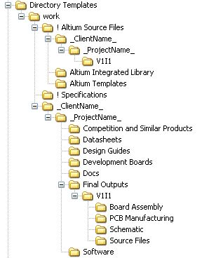
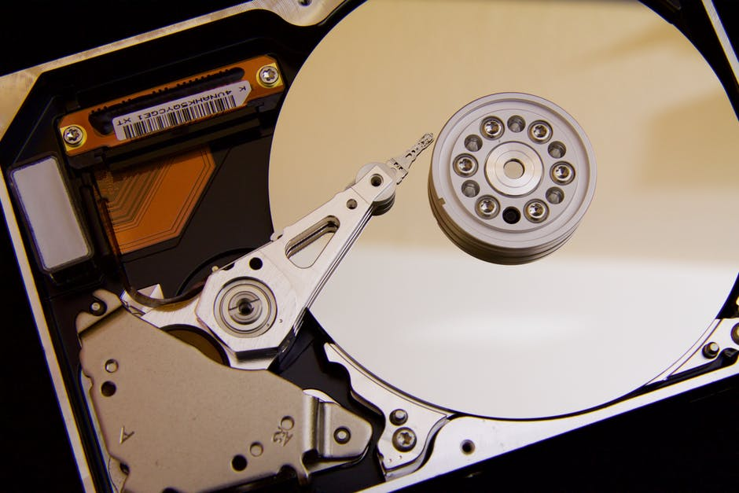
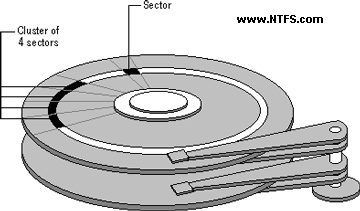
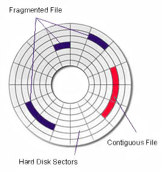
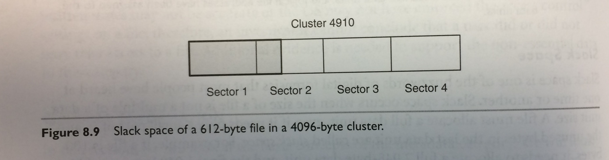
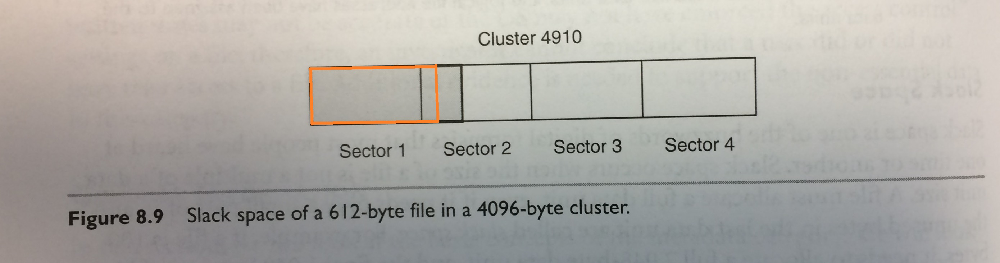
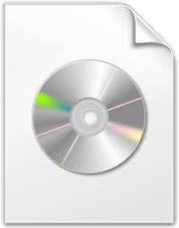

# Born-Digital Records  in Practice at UAlbany

Gregory Wiedeman 
University Archivist

---

## Some Background

M.E. Grenander Special Collections & Archives 
University at Albany, SUNY
* 4 permanent archivists, 1 on grant funding
	* Department Head
	* Supervisory Archivist (Manuscripts and Front Desk)
	* Curator of Digital Collections
	* University Archivist
* 3-4 Graduate students
* Undergraduate work study students

---

## Overview of University Archives

* University Records
	* Office of the President
	* University Senate
	* University Council
	* Office of the Provost
	* Graduate & Undergraduate Education
		* Records of Schools and Colleges
		* Records of Academic Departments
	* Web Archives
* Student Groups and Manuscripts
	* Student Association
	* Albany Student Press
	* Faculty and Alumni Papers

---

## Collecting Background

* Formal records management program until cut in 1990s
	* Very effective collecting in 1970s
* Records Management "distributed" among offices
* Permanent Records <i>should</i> come to me
* Large paper backlog
* Establishment of extensible processing practices

---

### What does this have to do with Born-Digital Records

* Concensus that Disk Imaging is most effective way to preserve born-digital records
* This poses real problems for public records

---

### A Bit about File Systems

<ul>
<li>File Allocation Table (FAT)</li>
<li>New Technology File System (NTFS)</li>
<li>HFS Plus</li>
<li>ext4</li>
<li>exFAT</li>
</ul>

---

### How File Systems Work

<ul style="float: right; width: 60%">
<li>Not designed for preservation</li>
<li>Designed for efficiency</li>
<li>Quick Retrieval</li>
</ul>

---

## Inefficient Storage

<!-- .slide: data-background="img/istorage2.jpg" -->

---

## Efficient Storage

<!-- .slide: data-background="img/estorage.jpg" -->

---

## File Systems are designed for Efficiency

* Files are abstractions
* Pointers to where data is stored
* Unix systems use Inode pointers
* NTFS uses $MFT (Master File Table)

[https://www.bloomberg.com/graphics/2015-paul-ford-what-is-code/](https://www.bloomberg.com/graphics/2015-paul-ford-what-is-code/)

---

### Where is a File?

---

<!-- .slide: data-background="img/istorage2.jpg" -->

---

## Where do Files Live?

---

## Where do Files Live?

---

## NTFS on Windows

Brian Carrier, <i>File System Forensic Analysis</i> (Addison-Wesley, 2005), p. 283

---

## $MFT (Master File Table)

Carrier, p. 280

---

## $MFT (Master File Table)

Carrier, p. 295

---

## $MFT Timestamps Demo

---

## Deleting Files

---

## Efficiency in Sectors

---

## Efficiency in Sectors

Carrier, p. 188

---

## Slack Space

Carrier, p. 188

---

## Imaging the Disk

 --> 

---

## Disk Images

<ul style="float: left; width: 45%">
<li>.dd</li>
<li>.EWF</li>
<li>.AFF</li>
<li>.ISO</li>
</ul>

<ul style="float: right; width: 45%">
<li>Unix disk dump utility</li>
<li>FTK Imager</li>
<li>Guymanger</li>
<li>ImgBurn</li>
</ul>

---

#### [Ben Goldman, "Outfitting a Born-Digital Archives Program" <i>Practical Technology for Archives</i>&nbsp;&nbsp; Issue 2 (June 2014)](http://https://practicaltechnologyforarchives.org/issue2_goldman/)

<!-- .slide: data-background="img/diskImaging.jpg" -->

---

## What Can We Learn from a Disk Image?

* File metadata
	* Timestamps
	* Logs and Journals
	* Registries
* Deleted Files not overwritten
* Data in Slack Space
* Corrupted Data

---

## So, What does all this mean?

* Disk imaging keeps all the bits
	* More than what you can see on your computer
* Great for manuscripts
	* David Baldus Papers
	* Maurice Hinchey Papers

---

## Overview of University Archives

* University Records
	* Office of the President
	* University Senate
	* University Council
	* Office of the Provost
	* Graduate & Undergraduate Education
		* Records of Schools and Colleges
		* Records of Academic Departments
	* Web Archives
* Student Groups and Manuscripts
	* Student Association
	* Albany Student Press
	* Faculty and Alumni Papers

---

## Records Created by the University are Public Records

* [Academic Affairs (Provost)](http://system.suny.edu/media/suny/content-assets/documents/compliance/info-management/records/Academic-Affairs-Schedule.pdf)
* [Office of the President](http://system.suny.edu/media/suny/content-assets/documents/compliance/info-management/records/Executive-Records.pdf)

University Records are subject to FOIL <!-- .element: class="fragment" data-fragment-index="1" -->

---

## Born-Digital Records Collecting in Practice

* Files dispersed around the University
	* Local Computers
	* Network Shares
	* Cloud Storage

---

<!-- .slide: data-background="https://s3.amazonaws.com/media-p.slid.es/imports/471978/4uLaRRIF/4uLaRRIF_002.png" -->

---

## ANTS issues

* Difficulty to get records creators to commit
	* Training
	* Required wider commitment
* Availability of network shares
* Maintenance
	* Library and packaging issues
* Really an authentication issue

---

<!-- .slide: data-background="img/transferShares.png" -->

---

## Transfer Scripts

* Network Folder Share
	* Archives and creator has access
* Python script run on task scheduler
* Weekly checks for new files
* CSV log files of files transferred
* Creates XML accession metadata file
* Runs createSIP.py command line tool

---

## createSIP.py demo

---

<!-- .slide: data-background="img/oais.png" -->

---

## What is a SIP?

* Different interpretations of SIP, AIP, DIP

---

## Into ArchivesSpace

* asInventory tool
* [ASpace Example](http://169.226.92.25:8080/resources/387#tree::archival_object_134438)
* [XTF Access System Example](http://meg.library.albany.edu:8080/archive/view?docId=ua100.xml#a61dcbbb42fbd4c6fc8133d7d1bab871)
* SIP = bag?
* AIP = ArchivesSpace record?
* DIP = PDF on web server?

---

## Born-Digital Photography

* [Processing University Photographs](http://www.gregwiedeman.com/presentations/slides/sipPics.html)
* [Results](http://meg.library.albany.edu:8080/archive/view?docId=ua395.xml)

---

## Maintenance

* Scripts break over time
	* No more ad-hoc approaches
	* No more XML data stores
* Network of well-maintained interoperable tools
* ArchivesSpace Migration

---

## Espy Project

* [Espy Project Announcement](http://library.albany.edu/archive/espyproject)
* Hydra Implementation
* Ruby on Rails connected to Fedora 4
	* Native Linked Data

---

### Fedora 4 Data Model

---

## Portland Common Data Model

---

## Hydra::Works

---

<!-- .slide: data-background="img/systemDesign.jpg" -->

---

## Other Projects

* [Project Electron at Rockefeller Archive](http://projectelectron.rockarch.org/)
* [ArcLight Project](https://wiki.duraspace.org/display/hydra/ArcLight+Design+Documents)

---

## Questions