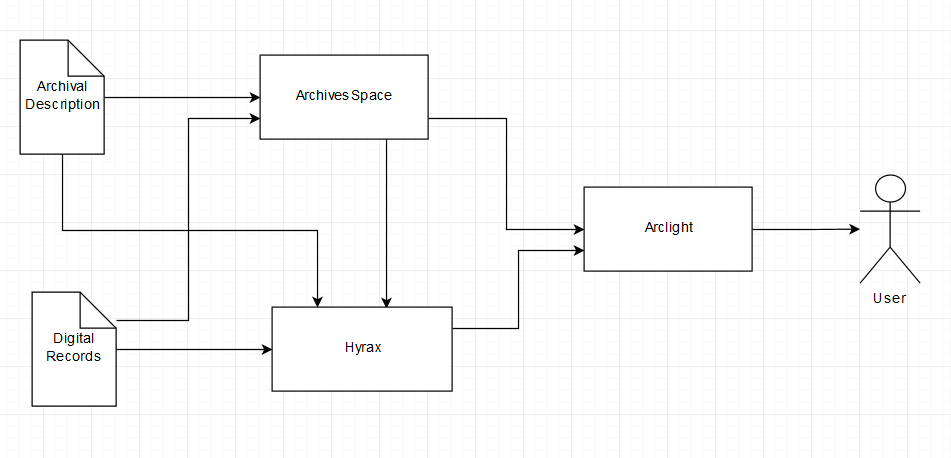
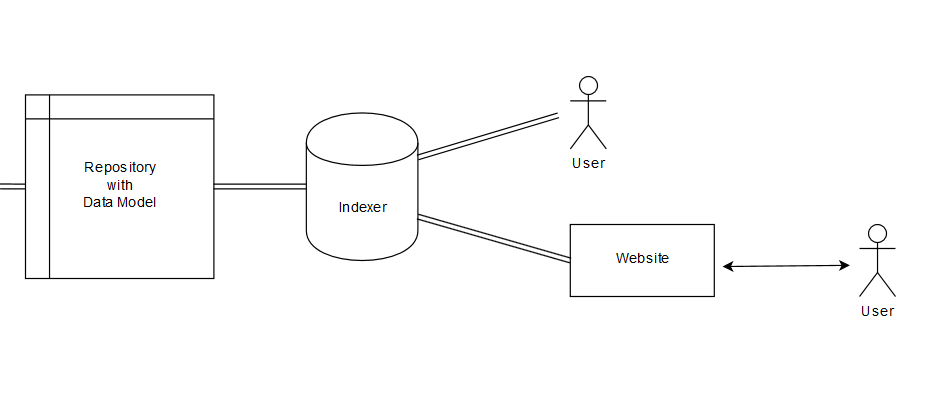

## The Espy Project

#### Building Digital Infrastructure

---

## University Archives

* Collect permanent university records

* Make them accessible

---

## Traditional Practices

* Collecting during office moves, when storage areas get crowded

* Call the University Archivist for information

---

## The University Archives

* University Records
	* Office of the President
	* University Senate
	* University Council
	* Office of the Provost
	* Graduate & Undergraduate Education
		* Records of Schools and Colleges
		* Records of Academic Departments
	* Web Archives
* Student Groups and Manuscripts
	* Student Association
	* Albany Student Press
	* Faculty and Alumni Papers

---

## Building a Modern Collecting Program

* Automated digital transfers
* Web crawling
* Disk imaging of external media
* Paper when maintained as such
* Format-neutral practices
* Requires digital infrastructure

---

## Born-Digital Records Collecting in Practice

* Files On the Live Web
	* Web crawling
* Files dispersed around the University
	* Local Computers
	* Network Shares
	* Cloud Storage
	* Different Software Applications
	* Private Computers

---

<!-- .slide: data-background="img-iipc/minutes.png" -->

---

<!-- .slide: data-background="img-iipc/undergradBulletin.png" -->

---

<!-- .slide: data-background="img/applications1.png" -->

---

<!-- .slide: data-background="img/applications2.png" -->

---

#### [Ben Goldman, "Outfitting a Born-Digital Archives Program" <i>Practical Technology for Archives</i>&nbsp;&nbsp; Issue 2 (June 2014)](http://https://practicaltechnologyforarchives.org/issue2_goldman/)

<!-- .slide: data-background="img/diskImaging.jpg" -->

---

## Establishing a Collecting Program

---

## Transfer Scripts

* Network Folder Share
	* Archives and creator has access
* Python script run on task scheduler
* Weekly checks for new files
* CSV log files of files transferred
* Creates XML accession metadata file
* Runs createSIP.py command line tool
* Enters line in accessions.xlsx
* Manual collecting over GoogleDrive

---

<!-- .slide: data-background="img/transferShares.png" -->

---

## Establishing a Collecting Program

* \\\\LINCOLN\Library\UA200

* [Transfer Script](https://github.com/UAlbanyArchives/ua200/blob/master/ua200.py)

---

## Establishing a Collecting Program

---

## Establishing a Collecting Program

---

## Current Storage

* \\\\romeo\SPE\ua200-7VsAhYXbfYg3EKXaypCJeD

---

## Current Access System

* [University Senate Records](http://meg.library.albany.edu:8080/archive/view?docId=ua200.xml)
* [Luna DAMS](http://library.albany.edu/archive/digitalselections)
* [Digital Media Department](http://meg.library.albany.edu:8080/archive/view?docId=ua395.xml)

---

## Maintenance

* Scripts break over time
	* No more ad-hoc approaches
	* No more XML data stores
* Network of well-maintained interoperable tools

---

## Introduction to APIs

* [Wayback Machine](https://web.archive.org/web/*/http://www.albany.edu/undergraduate_bulletin/)

* <a href="https://web.archive.org/cdx/search/cdx?url=http://www.albany.edu/undergraduate_bulletin/">Wayback Machine API</a>

* [Archive-It](https://partner.archive-it.org/login?next=/archiveit)
* [Page for Crawl](https://partner.archive-it.org/652/collections/6916/crawl/552635)
* [API for Crawl](https://partner.archive-it.org/api/crawl_job/552635)

---

## What can you do with APIs?

* [ArchivesSpace](http://169.226.92.31:8080/)
* [Office of Diversity and Inclusion](http://169.226.92.31:8080/resources/415)
* [ArchivesSpace API](http://169.226.92.31:8089/)
	* python2
	* from archives_tools import aspace as AS
	* session = AS.getSession()
	* odi = AS.getResource(session, "2", "415")
	* AS.pp(odi)
	* print odi.title
	* print odi.finding_aid_author

---

## APIs: Solving Problems with Maintainable Solutions

* [David Baldus Papers](http://169.226.92.31:8080/resources/227#tree::archival_object_78037)
* C:\Projects\asInventory
	* python2 asDownload.py
	* 16b7133df26424617e649391b53ea6ce

---

## Separation of Concerns: Smaller Tools

* [Find-it](http://libstaff/find-it/index.html)
* [Director of Planning Records](http://meg.library.albany.edu:8080/archive/view?docId=ua020.xml)
* [Box uploader](http://libstaff/find-it/boxes.html)
* \\\\libstaff\wwwroot\find-it

---

<!-- .slide: data-background="img/systemDesign.jpg" -->

---

## An Interoperable Repository with APIs

* ArchivesSpace for Managing Metadata
	* Spreadsheet tool
	* Find-it
* Archive-It for Web Archives
* [Hyrax Repository for Digital Storage](http://169.226.92.29:8081/) <!-- .element: class="fragment" data-fragment-index="1" -->

---

## Portland Common Data Model

---

## API Access Allows Maintainable Workflows

* [API Access]

---

## Open, Interconnected Workflows

1. Detect accession
2. Get contextual data from ArchivesSpace API
4. Ingest into digital repository
5. Que for review 
6. Expose data into central search index

---

## An Interoperable Repository with APIs

---

## An Interoperable Repository with APIs

* ArchivesSpace for Managing Metadata
	* Spreadsheet tool
	* Find-it
* Archive-It for Web Archives
* [Hyrax Repository for Digital Storage](http://169.226.92.29:8081/)
* [Arclight for Public Access](http://169.226.92.29:8080/repositories) <!-- .element: class="fragment" data-fragment-index="1" -->

---

## APIs also Make Access Possible

---

---

## What it will Look Like

* [Arclight](http://169.226.92.29:8080/?f%5Bhas_online_content_ssim%5D%5B%5D=online&q=&search_field=all_fields)

---

## Repository Supports

* University Records Collecting
* [API access to collections](http://169.226.92.29:8080/catalog/ua200aspace_42c592cd855d47df4a37b6bc9ea67991?format=json)
	* Enables new research
* On-Demand Digitization
* Born-Digital Outside Collecting
	* New York Modern Political Archive
	* National Death Penalty Archive

---

<!-- .slide: data-background="http://library.albany.edu/sites/all/themes/New_UArchives/img/full/news1.jpg" -->

---

## New Possibilities

* [Espy Metadata Tool](http://169.226.92.29/)

---

<!-- .slide: data-background="img/espyMetadata.png" -->

---

## The Espy Project

#### Building Digital Infrastructure

