

## Processing Born-Digital Images at Scale

#### Gregory Wiedeman
#### University Archivist
#### University at Albany, SUNY
#### NSDA Content Interest Group

---

### Born-Digital Photography at UAlbany

* Began in 1999
* Campus Photographer in Digital Media Department
* Photographer is state employee, so images are public records!
* Two periods, with gap in-between
    * 1999-2010 wrote files to DVDs, Access DB
    * 2012-present SmugMug service

---

#### Growth of Born-Digital Photography 1999-2010

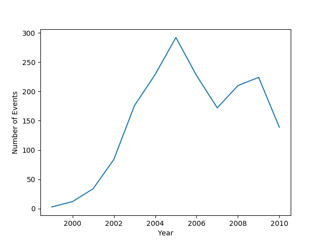

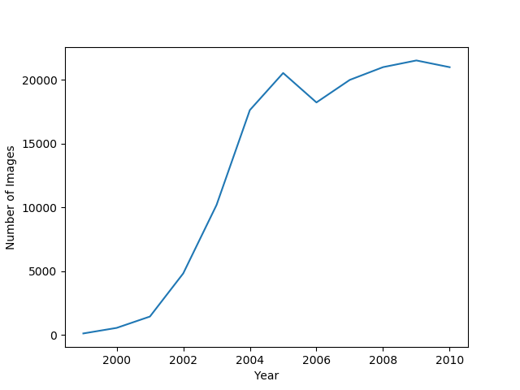

---

### 1999-2010 Period

<ul>
<li>4 Boxes of DVDs, about 600 disks</li>
    <ul>
        <li>about 20 CD-Rs</li>
    </ul>
<li>1.8 TB of data</li>
<li>Camera Raw files (.NEF, .CR2) and .JPG derivatives of used images</li>
</ul>

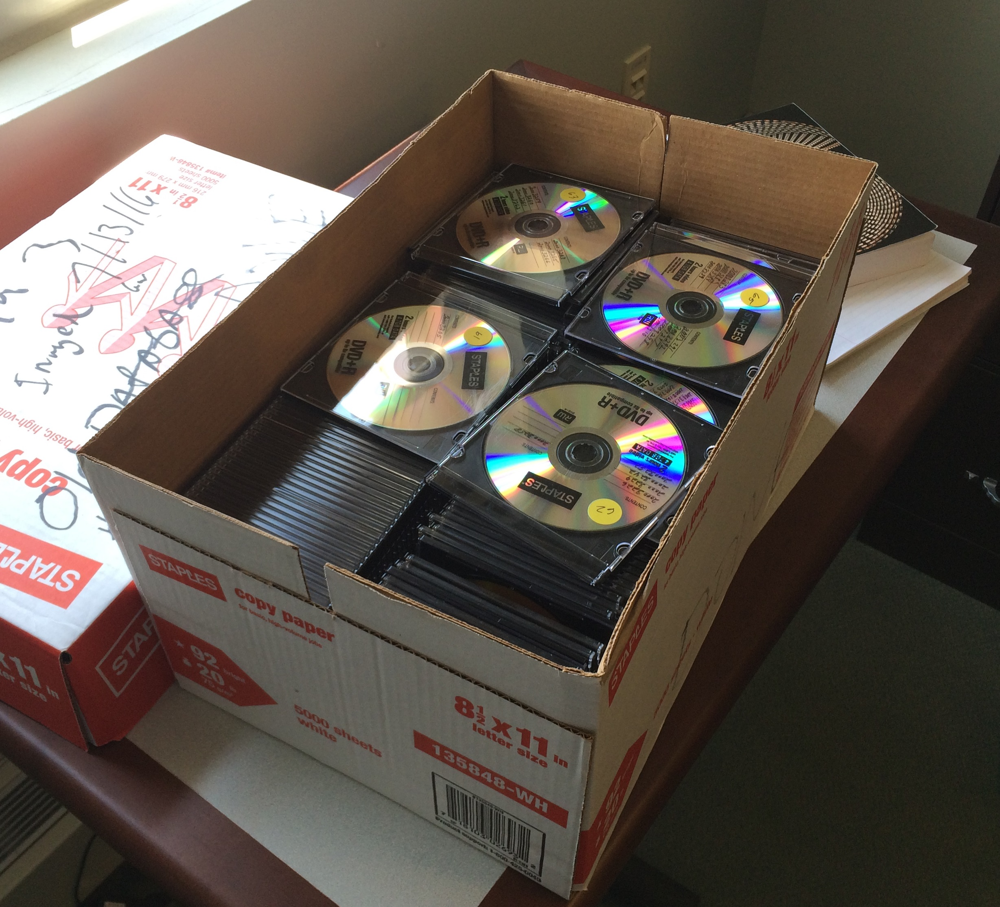

---

### 1999-2010 Period

<ul>
<li>Job number folder contained images, written on disk</li>
<li>Metadata in Access DB</li>
<ul>
    <li>Date</li>
    <li>Photographers description of event</li>
    <li>Costs, etc.</li>
</ul>
</ul>

---

### Previous Work

* Student Assistant manually selecting images
* Adding detailed item-level metadata
* Upload to Luna DAMS
* Small Percentage over years.

---

### 2012-present

<ul>
<li>SmugMug service</li>
<ul>
    <li>Online photo web app</li>
    <li>about 20,000 images</li>
</ul>
<li>Photographer Uploads selection of images with metadata</li>
</ul>

---

<!-- .slide: data-background="img/smugmug3.png" -->

---

<!-- .slide: data-background="img/smugmug4.png" -->

---

<!-- .slide: data-background="img/smugmug5.png" -->

---

## Needs

* Automation
    * Need to scale
    * No metadata creation, must describe themselves
* Transparency
    * Researchers need context
* Access
    * No restrictions, immediate public access
    * Presentation within existing collections (EAD)
    * Support reference work now

---

## SmugMug has an API

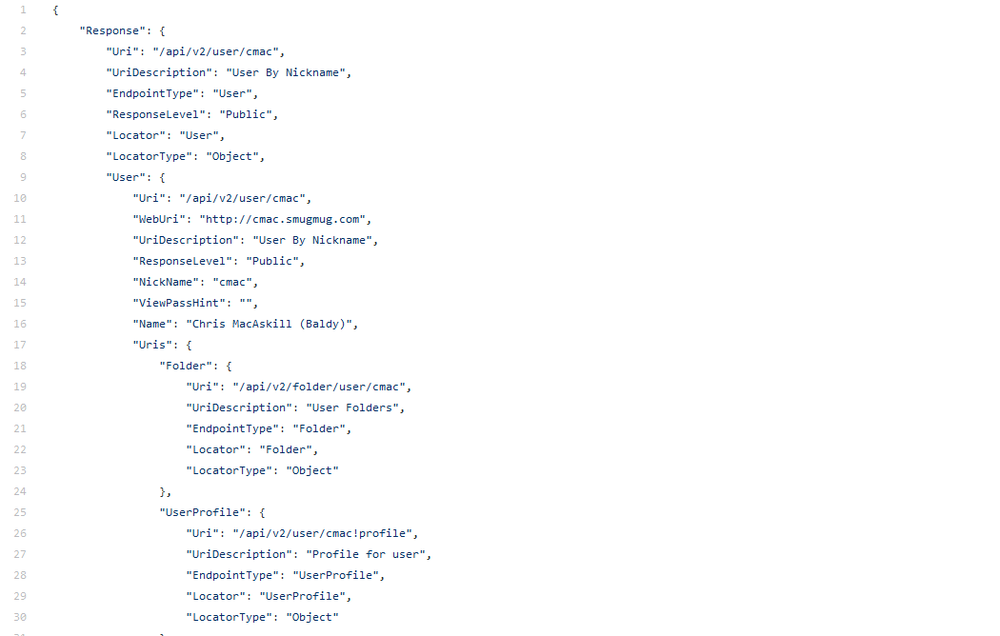

---

## Using Python

* Python is great at working with data across systems
* Requests library to query SmugMug API
* os library to read filesystem, copy files
* Subprocess to call other command line tools
    * TSK, ImageMagick
* Bagit-python
* lxml to work with XML and EAD

---

## Crawling SmugMug

* Wrote a crawler for SmugMug
* Download all images
* Periodically crawl for updates
* Hash index to see if already downloaded
* Package in to Bags with XML metadata file
    * Directory structure and descriptive metadata
* Separate script to write metadata into EAD files

---

## Mass Image DVDs

* Used BitCurator Forensic Machine
* Ripping from disk ran into Filesystem issues
    * different ISO formats
* Running dd was most dependable
* 5 external disk drive

---

## Mass Image DVDs

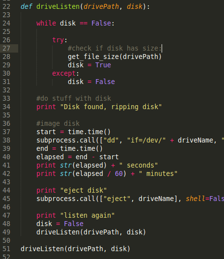

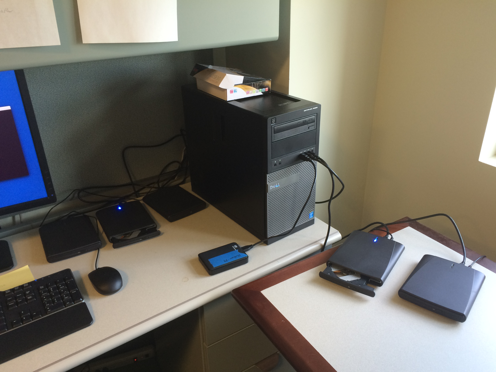

---

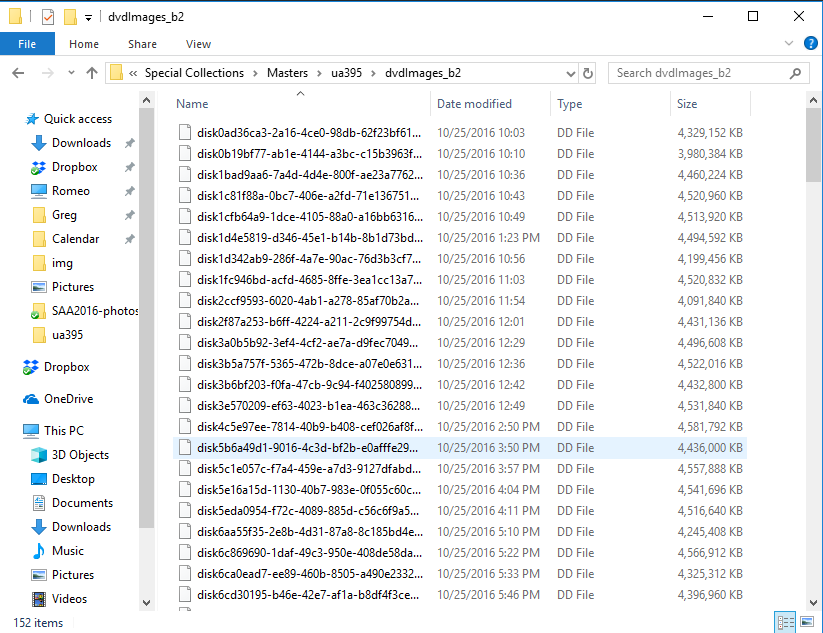

---

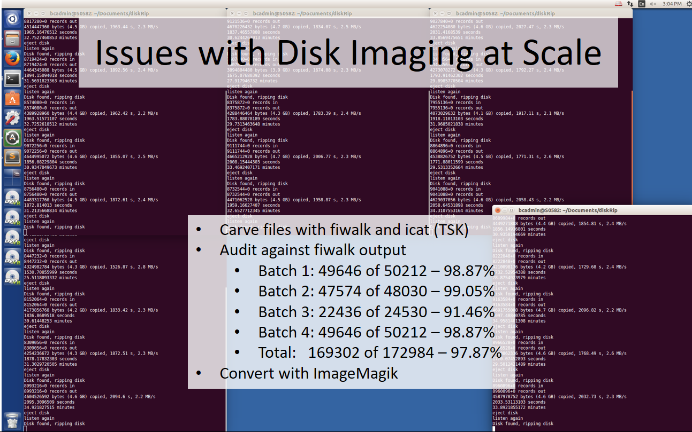

---

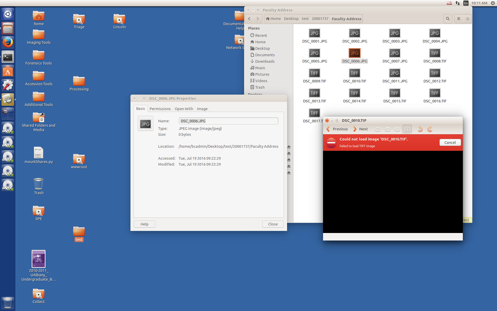

---

## Appraisal in Born-Digital Processing

* Archives manage materials at scale
* Time-limited project, initially less than 2 months
* Other collections need attention

---

## Appraisal Decisions

* Not to retain camera raw permanently
    * Large, access barrier
    * Not a final product, proprietary
* Convert all files to JPG
    * 1.8 TB down to a managable 274 MB
* Not spending time recovering all files
    * diminishing returns

---

## JPEG compression!?

* Edited, used pre-2010 images were JPGs
    * Why go back to unedited raw?
* All post-2010 images through SmugMug were JPGs
* JPG compression visually looked the best
* Purpose of collection was to document university events
* Users happy with JPGs
* Not using compression is not a preservation strategy

---

<!-- .slide: data-background="img-saa16/compare1.png" -->

---

## In the Spirit of OAIS

* SIPs are non-permanent .dd images and Access DB exports
* AIPs are processed bags with metadata 
* DIPs are metadata in EAD, linked to JPGs on web server

---

## The SIPs/AIPs

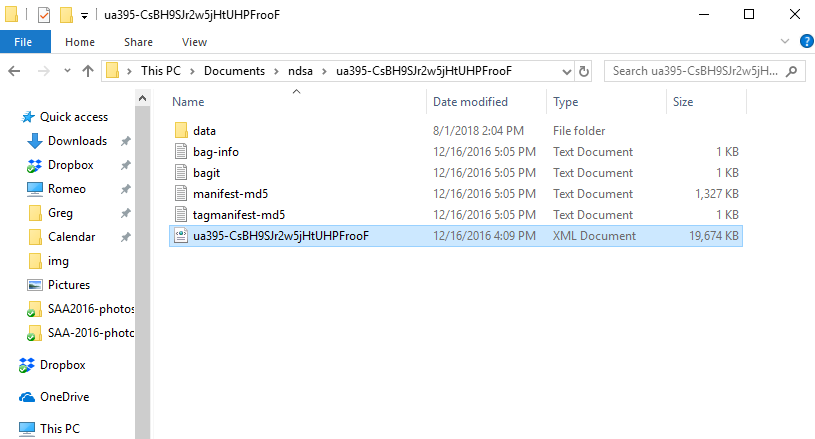

---

## Access

* Python-gererated static pages linked from [XTF finding aids](https://meg.library.albany.edu:8443/archive/view?docId=ua395.xml)

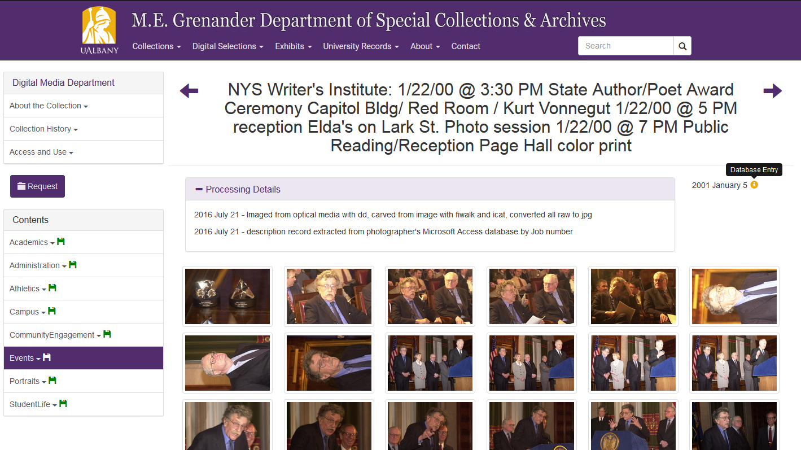

---

### Things I've learned

* This gets complicated
* Just because you can script it, doesn't mean its a sustainable workflow
* You can put any junk in XML
* Maintenance is an issue
* Infrastructure first

---

## Building Infrastructure

* Stopped collecting from SmugMug for now
* Arclight for archival description
* Hyrax repository for digital archives content
    * connects to Arclight API
    * backed by data model
* New [SIP/AIP Model](https://github.com/UAlbanyArchives/createSIP)
    * Validate to Spec using [Bagit-profiles](https://github.com/bagit-profiles/bagit-profiles)
    
---

## Future Plans

* Network of open systems connected by REST APIs
* Ingest utility
    * Make Bag according to Spec
    * Post to Hyrax, backed by Data Model
    * Post accession to ArchivesSpace
* Processing utility
    * Any content processing
    * Post description to ArchivesSpace, exposed in Arclight
    * Post public content to Hyrax, linked to Arclight description

