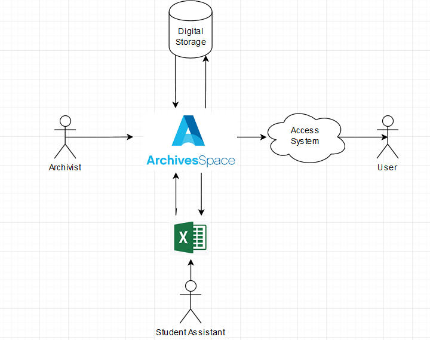
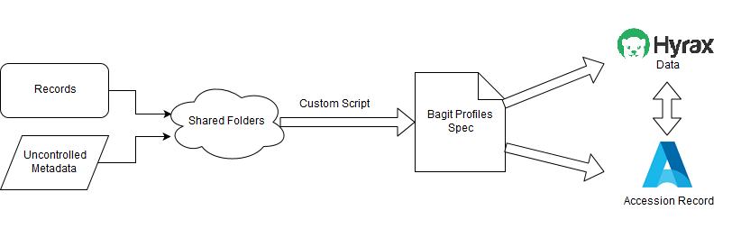
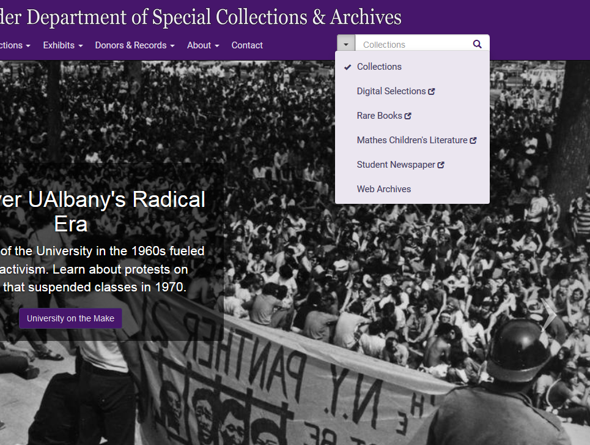

## Born-Digital Records at UAlbany

 
 
##### Gregory Wiedeman
##### University Archivist
##### University at Albany, SUNY
##### GWiedeman@albany.edu
##### <a>@gregwiedeman</a>

---

## Born-Digital Records at UAlbany

* Building Born-Digital infrastructure
* Making Access Familiar
* Challenges (they're not really technical)

---

## The University Archives

* University Records
	* Office of the President
	* University Senate
	* University Council
	* Provost and Academic Affairs
		* Records of Schools and Colleges
		* Records of Academic Departments
	* Research Centers and Institutes
* Student Groups and Manuscripts
	* Student Association
	* Albany Student Press
	* Faculty and Alumni Papers

---

## Traditional Practices

* Driven by physical space

* Collecting during office moves, when storage areas get crowded

* Call the University Archivist for information

* <!-- .element: class="fragment" data-fragment-index="1" -->This model no longer works

---

## Need to Demonstrate Value to Creators

* Today most permanent records are created digitally
* Digital space is less of a barrier
* Creators want near-immediate access

---

## Born-Digital Records Collecting in Practice

* Files On the Live Web
	* Web crawling
* Files dispersed around the University
	* Local Computers
	* Network Shares
	* Cloud Storage (OneDrive)
	* Different Software Applications
	* Private Computers

---

<!-- .slide: data-background="img-iipc/minutes.png" -->

---

<!-- .slide: data-background="img-iipc/undergradBulletin.png" -->

---

<!-- .slide: data-background="img/applications1.png" -->

---

<!-- .slide: data-background="img/applications2.png" -->

---

#### [Ben Goldman, "Outfitting a Born-Digital Archives Program" <i>Practical Technology for Archives</i>&nbsp;&nbsp; Issue 2 (June 2014)](http://https://practicaltechnologyforarchives.org/issue2_goldman/)

<!-- .slide: data-background="img/diskImaging.jpg" -->

---

## Born-Digital Collecting Priorities

1. Automated digital transfers over network storage
2. Web crawling
3. Disk imaging of robust external media
4. Manual transfer over cloud storage
5. Records in web-based systems with open APIs
6. Paper when maintained as such
7. Records in closed systems
8. Disk imaging of magnetic media

---

## Establishing a Collecting Program

* Network Folder Share
	* Archives and creator has access
	* Python script run on task scheduler
	* Weekly checks for new files
	* CSV log files of files transferred
	* Creates XML accession metadata file
	* Runs createSIP.py command line tool
	* Enters line in accessions.xlsx
* Custom scripts for SmugMug and other systems with APIs
* Manual collecting over GoogleDrive

---

<!-- .slide: data-background="img/transferShares.png" -->

---

## Current Storage

* \\\\romeo\SPE\ua200-7VsAhYXbfYg3EKXaypCJeD

---

## Establishing a Collecting Program

* [Transfer Script](https://github.com/UAlbanyArchives/ua200/blob/master/ua200.py)

---

## Establishing a Collecting Program

---

## Establishing a Collecting Program

---

## Establishing a Collecting Program

---

## Current Access System

* [University Senate Records](http://meg.library.albany.edu:8080/archive/view?docId=ua200.xml)
* [Luna DAMS](http://luna.albany.edu/luna/servlet/s/pppxob)
* [Digital Media Department](http://meg.library.albany.edu:8080/archive/view?docId=ua395.xml)

---

## Maintenance

* Scripts break over time
	* No more ad-hoc approaches
	* No more XML data stores
* Network of well-maintained interoperable tools
	* APIs connections
	* Data Models

---

## Things I don't really care about

* File formats
	* identification
	* validation
	* migration for preservation
* Literal interpretation of OAIS
* Compression
* Any micro preservation activity

---

## Things I do care about

* Automation/scale
* Description/content standards
* Maintenance
* Documentation
* Access

---

## Introduction to APIs

* [Wayback Machine](https://web.archive.org/web/*/http://www.albany.edu/undergraduate_bulletin/)

* <a href="https://web.archive.org/cdx/search/cdx?url=http://www.albany.edu/undergraduate_bulletin/">Wayback Machine API</a>

* [Archive-It](https://partner.archive-it.org/login?next=/archiveit)
* [Page for Crawl](https://partner.archive-it.org/652/collections/6916/crawl/552635)
* [API for Crawl](https://partner.archive-it.org/api/crawl_job/552635?format=json)

---

## ArchivesSpace is the Key

---

## What can you do with ASpace API?

* Automate any changes at any scale
	* Data Model makes sure its consistent
* Connect with other systems
* Develop interoperable workflows
* Rely on the community for sustainable code
* [ArchivesSnake](https://github.com/archivesspace-labs/ArchivesSnake) makes it easier

---

## Separation of Concerns: Smaller Tools

* [Find-it](http://libstaff/find-it/index.html)
	* \\\\libstaff\wwwroot\find-it
* [asInventory](https://github.com/UAlbanyArchives/asInventory)
	* \\\\LINCOLN\\Library\\SPE Staff\\Greg\\asInventory
* [Box uploader](http://libstaff/find-it/boxes.html)

---

## Data Models!

---

<!-- .slide: data-background="img/linkedData.png" -->

---

## An Interoperable Repository with APIs

* ArchivesSpace for Managing Metadata
	* Spreadsheet tool
	* Find-it
* Archive-It for Web Archives
* [Hyrax Repository for Digital Storage](http://169.226.92.29:8080/catalog?utf8=%E2%9C%93&search_field=all_fields&q=)
* [Arclight for Access](http://169.226.92.29/catalog/ua200aspace_0c72d6b94d313b11ddcef771ce8dac46)
* [Make Automatic Connections!](http://169.226.92.29:8080/concern/digital_archival_objects/new?locale=en)

---

## API Access Allows Maintainable Workflows

---

## Open, Interconnected Workflows

1. Detect accession
2. Get contextual data from ArchivesSpace API
4. Ingest into digital repository
5. Que for review 
6. Expose data into central search index

---

## Make Access Familiar

* Discoverable alongside paper records
* In context with upper level Archival Description
* Purpose of website is to access paper and digital records
* Demonstrate value to campus and outside donors
* Computational access to collections data
	* Researchers use APIs too
	* Rights for this part of EAD and DACS

---

---

## An Interoperable Repository with APIs

---

## Practical Challenges

* Administering Hyrax Sustainably
* Advocacy and legwork with creators
* Updating
* Maintenance

---

## Wider Challenges

* Technical Literacy
	* Data modeling
	* User Experience Design (UX)
* Resources demands
	* Use extensible processing
* Communication
	* Getting archivists and technologists on the same page
* System Administration and *minimal* custom development
	* Staffing and administration problem
	* Programmer-Archivists is not a great solution
* Demonstrate Value
	*  Chicken and Egg problem

---

## Strengths

* Community
* Openness
* Archivists are awesome

---

## Born-Digital Records at UAlbany

 
 
##### Gregory Wiedeman
##### University Archivist
##### University at Albany, SUNY
##### GWiedeman@albany.edu
##### <a>@gregwiedeman</a>