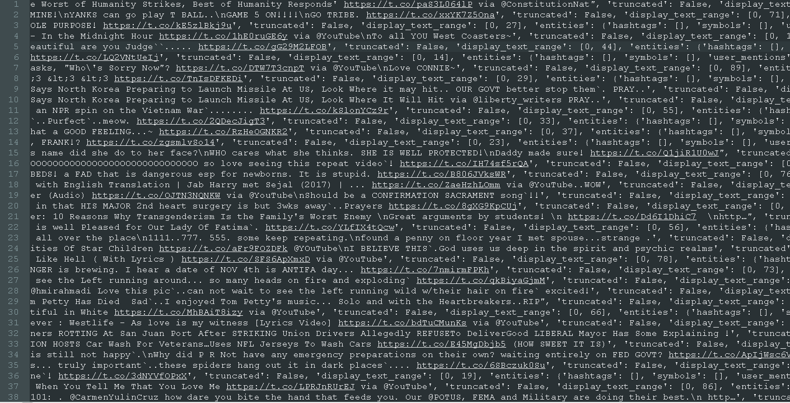

## Data Analytics Approaches for Web Archives

Gregory Wiedeman 
University Archivist 
M.E. Grenander Department of Special Collections & Archives

---

<!-- .slide: data-background="img/stacks.jpg" -->

---

<!-- .slide: data-background="img-iipc/undergradBulletin.png" -->

---

## Collecting the Web at UAlbany

* Preserve and manage permanent public records
* Crawling and preserving albany.edu since 2012
* Began outside collecting in 2016
* 1.5 TB of Web Data
* Collect, preserve, provide access, and encourage use

---

<!-- .slide: data-background="img/uaWebArchives.png" -->

---

<!-- .slide: data-background="img/docnow.png" -->

---

## Twitter Data

* Detecting Russian bots: it`s
* Ed Summers [apostrophe dataset](https://github.com/edsu/apostrophe) 40 accounts
* Collected 14,217 tweets with [Twarc](https://github.com/DocNow/twarc)

---

<!-- .slide: data-background="img/botLang.png" -->

---

<!-- .slide: data-background="img/botClouds.jpg" -->

---

<!-- .slide: data-background="img/ny19.png" -->

---

<!-- .slide: data-background="https://cdn-images-1.medium.com/max/2000/1*E0WUcF2AdNDoeflM_iCkGg.jpeg" -->

<a href="https://medium.com/@d1gi/the-election2016-micro-propaganda-machine-383449cc1fba" style="background-color:white; padding: 10px;white-space: nowrap;border: 2px solid rgba(255, 255, 255, .6);background-clip: padding-box;">Jonathan Albright, "The #Election2016 Micro-Propaganda Machine"</a>

---

## Working with WARCs

* .warc file ISO standard
* Tremendous volume of data
* Mess of HTML, CSS, JavaScript
* Unclear provenance
* Standard derivative datasets <!-- .element: class="fragment" data-fragment-index="1" -->
* Tools becoming easier to use <!-- .element: class="fragment" data-fragment-index="1" -->

---

<!-- .slide: data-background="img/aut.png" -->

---

* 8595 of 10649 URLs were still live
* 81%

---

## Funding availability 

---

## Collecting the Web

* Smaller research-focused collections
* Work with Internet Archive to get older data

---

## Links

* [Github repo]
* [UAlbany Web Archiving Program](http://library.albany.edu/archive/webarchives)
* [An Open-Source Strategy for Documenting Events: The Case Study of the 42nd Canadian Federal Election on Twitter](http://journal.code4lib.org/articles/11358)
* [Archives Unleashed Toolkit](https://github.com/archivesunleashed/aut)
* [Warclight](https://github.com/archivesunleashed/warclight)