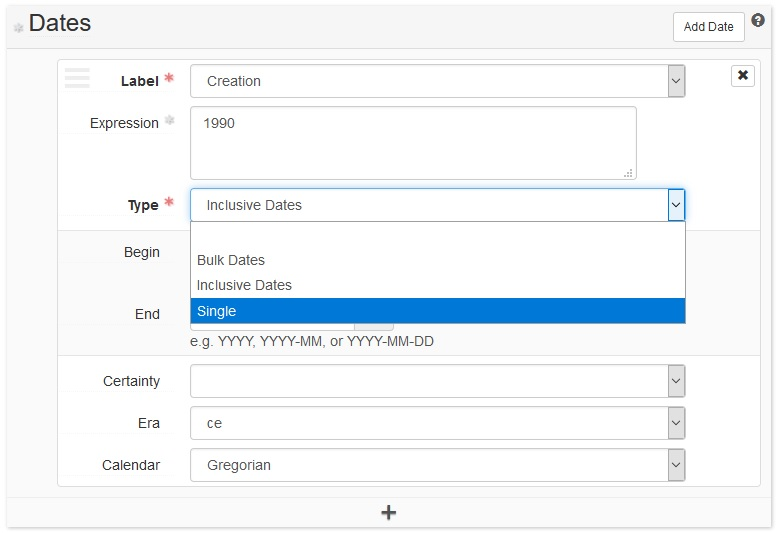
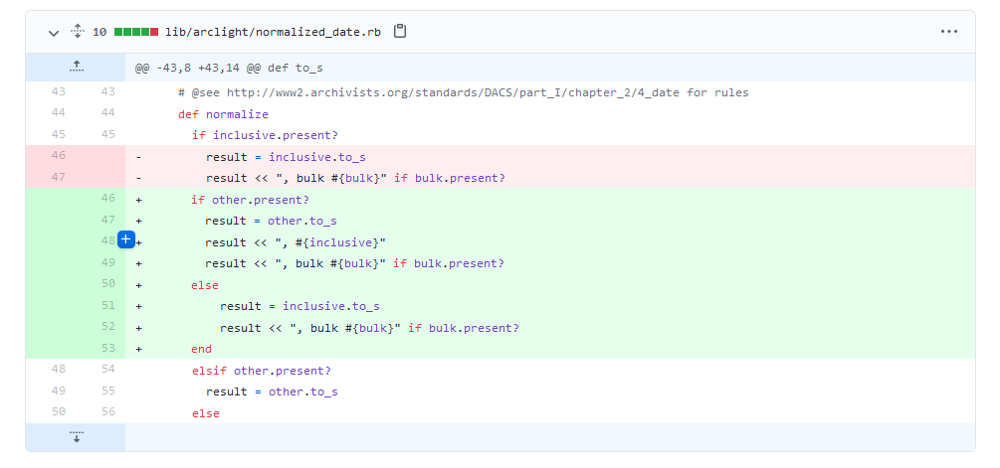
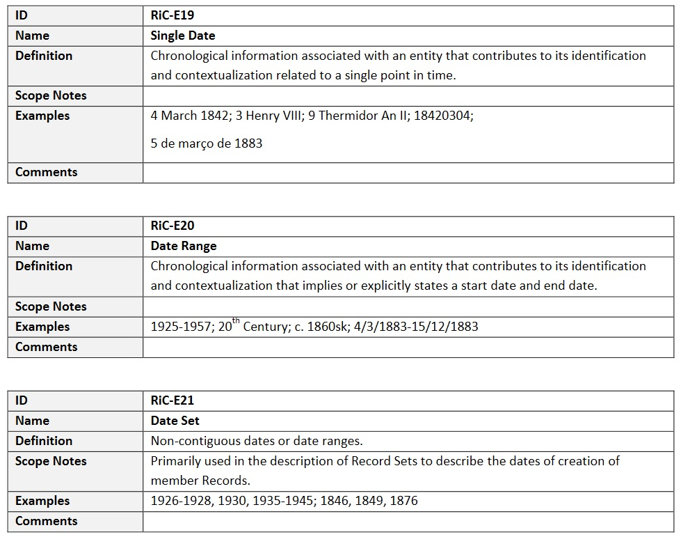
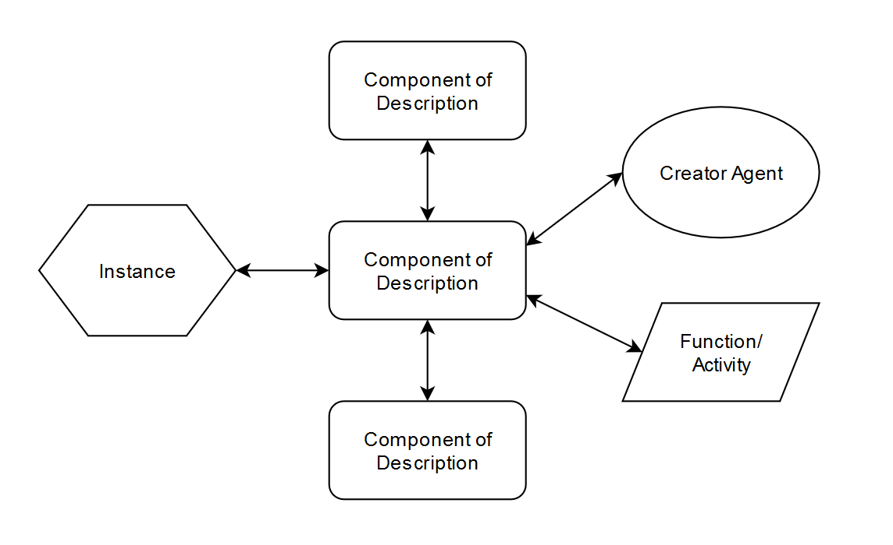

### Date Problems

---

* EAD2002:
	* TYPE – not required. May be used to specify whether the date is “bulk” or “inclusive.”
* EAD3:
	* @unitdatetype – not required. Use to record whether the unit dates are bulk or inclusive. Possible values: bulk, inclusive.

---

### Date types in ArcLight

* Combines dates to Solr field: `normalized_title_ssm`

---

* Data Structure Standard (MARC)
> "define what elements of information are contained in the components of an information system."

* Information Systems Standard (Z39.50)
> "define the roles of and interrelationships among each component within the overall system"

* What a Data Structure standard was originally supposed to be.
* ["Report of the Working Group on Standards for Archival Description," American Archivist 52, no. 4 (1989): 453-453.](https://doi.org/10.17723/aarc.52.4.qn5515l3671v1517)

---

### Records in Context

* Still fields not set of rules
* Opaque process

---

### Thinking in Abstractions

