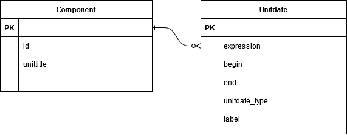

<style>
.fLeft {float: left; max-width: 50%;}
.fRight {float: right; max-width: 50%;}
#smallLink {font-size: 18px;}
.whitebg {background-color: #fff; padding: 30px !important;}
.reveal section img {border: none; background: rgb(255, 255, 255, 1);}
.reveal h1,
.reveal h2,
.reveal h3,
.reveal h4,
.reveal h5,
.reveal h6 {
	font-family: "Montserrat", Roboto , sans-serif;
	text-transform: initial;
	font-weight: bold;
}
.wrap{
position:relative;
  height:30vh;
  border-left:15px solid #000;
  padding:5vh 20px;
}
.arrow {
  position:absolute;
  left:-43px;
  width: 70px;
  bottom: -20px;
}
.up{top:-20px;}
.slide-background-content{background-size:contain!important;}
</style>

## From EAD to a Common Data Model

[gregwiedeman.com/slides/EAD2021.html](https://gregwiedeman.com/slides/EAD2021.html)

Gregory Wiedeman<br/>
University Archivist<br/>
University at Albany, SUNY

---

### My experience with EAD

* Learned technology by hand-encoding EAD
* Built tools to work with EAD
* Work with ASpace, ArcLight, Hyrax/Samvera
* Manage traditional archival processes
* EmpireADC advisor

---

### The Promise of EAD

> "An encoding standard would guarantee that the machine-readable finding aids created today would be usable tomorrow!"

Daniel V. Pitti, "The Berkeley Finding Aid Project," 1994 [http://archive1.village.virginia.edu/dvp4c/arlpap.htm](http://archive1.village.virginia.edu/dvp4c/arlpap.htm)

---

### One Final Format

* Structure your archival description
* Preservation format, future-proof
* Easily move data between systems

We need to give up on this dream <!-- .element: class="fragment" data-fragment-index="1" -->

---

### Archival systems still limited

* ArchivesSpace and other successful tools
* Front-end usability is still a problem
* No archival system to manage digital objects
* Funding and sustainability are challenges

As the data structure standard, EAD defines how systems work with archival description <!-- .element: class="fragment" data-fragment-index="1" -->

---

### Hard to build systems with EAD

* Variability
	* `<unitdate>` within `<unittitle>`
* Mixed content
	* `<languagenote>`, `<title>`, `<date>`, etc.
* Designed with document in mind
* EAD3 is incremental improvement, adds more variability
	* `<languagedeclaration>`
	* `<unitdatestructured>`

---

### EAD is a Lossy Medium

* EAD does not have strict rules
* "Migration" problems
* EmpireADC example:


---

### EAD is Limiting for Aggregators

* "Raw" EAD is challenging to index
	* Hand-encoded
	* Custom authoring tools
* Requires skilled labor to normalize
* Aggregators need to rely on consistent EAD
	* ArchivesSpace
	* EmpireADC using Archipelago-based "form tool"

---

### From XML format to Data Model

<div class="fLeft">
	<ul>
		<li>Accept that description will live in multiple formats and systems</li>
		<li>Standardize data structure, not format</li>
	</ul>
</div>
<div class="fRight">
	
</div>

---

### Date Problems


---

* EAD2002:
	* TYPE – not required. May be used to specify whether the date is “bulk” or “inclusive.”
* EAD3:
	* @unitdatetype – not required. Use to record whether the unit dates are bulk or inclusive. Possible values: bulk, inclusive.
	
ASpace exported "single" `<unitdate>` without `@type`
	
---

### Date types in ArcLight

* Combines dates to Solr field: `normalized_title_ssm`


---

### ArcLight Bug

* Originally assumed one date
* then expected `@type="inclusive"` or `@type="bulk"`

General Administrative Files, 1965-1966, 1978-1990, 1963, 1994, undated

---

### Date Problems

* Misunderstanding between tools
* EAD does not clearly define the structure of dates


---

### Data Model: A Set of Rules



---

### Expressed in JSON

```
{
  "expression": "1958 May 31-1960 June 2",
  "begin": "1958-05-31",
  "end": "1960-06-02",
  "date_type": "inclusive",
  "label": "creation"
}
```

---

### Expressed in EAD2002

```
<unitdate label="creation" type="inclusive" normal="1958-05-31/1960-06-02">
	1958 May 31-1960 June 2
</unitdate>
```

---

### Expressed in EAD3

```
<unitdatestructured label="creation" unitdatetype="inclusive">
	<dateset>
		<daterange>
			<fromdate standarddate="1958-05-31">1958 May 31</fromdate>
			<todate standarddate="1960-06-02">1960 June 2</todate>
		</daterange>
	</dateset>
</unitdatestructured>
```

---

### Serialization is easier

* Let the technologists deal with that
* Rely on common conventions for implementations
	* EAD2002
	* EAD3
	* JSON
	* Records in Context ontology (RiC-O)
	* Spreadsheets

---

### EAD already relies on conventions

```
<extent>32 cubic ft.</extent>
<extent units="cubic ft.">32</extent>
```

---

### More inclusive approach

* Migtation will be required at some point
* Lowers cost of systems and integration
* Allows new possibilities for small repositories
	* Google Forms
	* Spreadsheets
* Allows broader professional participation

---

## From EAD to a Common Data Model

[gregwiedeman.com/slides/EAD2021.html](https://gregwiedeman.com/slides/EAD2021.html)

Gregory Wiedeman<br/>
University Archivist<br/>
University at Albany, SUNY