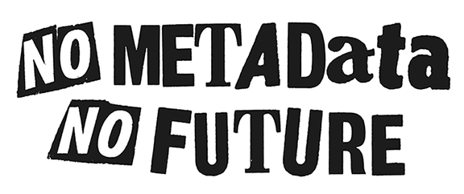

## Archives & Special Collections

Gregory Wiedeman 
University Archivist

---

## What is an archive?

---

* Manuscript tradition
* Public records tradition

---

* Archival appraisal
* Overview of the Department
* Arrangement & Description
* Systems
* Born-digital archives
* Stacks tour

---

### M.E. Grenander Department of Special Collections & Archives

* Collects unique records of enduring value
* Provide access and encourage use
* Control the boundaries of possible research

---

### "The archival sliver"

> "...the archival record is at once expression
and instrument of power."

Verne Harris, "[The Archival Sliver: Power, Memory, and Archives in South Africa](http://metafactory.ca/arch-eph/wp-content/uploads/2010/01/harris2002b.pdf)," *Archival Science* 2 (2002): 63-68.

---

### Archival appraisal

* not monetary value
* Selecting what gets saved

Michelle Caswell, "[Dusting for Fingerprints: Introducing Feminist Standpoint Appraisal](https://journals.litwinbooks.com/index.php/jclis/article/view/113)," *Journal of Critical Library and Information Studies* Vol. 3 No. 2 (2021)

---

### Coordination with other archives

* Colleges & Universities
* Government archives
* Business and nonprofit archives

---

### Collecting Areas

* Modern Political Archives
* National Death Penalty Archives
* University Archives
* Business, Literary, and Miscellaneous Manuscripts
* Rare Books
    * Mathes Childrens Literature Collection
* German and Jewish Intellectual Émigré

---

### Modern Political Archives

* State and Federal Representatives
* Rockefeller-era aids
* New York Coalition for Alternatives to Pesticides Records
* Women's Building Collection
* NOW NYS and Albany chapters
* NYCLU Records

---

### National Death Penalty Archives

* [Watt Espy Papers](https://archives.albany.edu/espy/)
* David Baldus Papers
  * *McCleskey v. Kemp*
* Catholics Against Capital Punishment Records
* Correctional Association of New York Records
* People on death row, family members

---

### Business, Literary, and Miscellaneous Manuscripts

* William Kennedy Papers
* Marcia Brown Papers
* Gregory Maguire Papers

---

### [The University Archives](https://archives.albany.edu/description/repositories/ua)

* University Records
  * Office of the President
  * University Senate & Council
  * Provost, Academic Administration
    * Centers & Institutes
    * Reference Collections
  * Web Archives
* Student Groups and Manuscripts
  * Student Association
  * Albany Student Press
  * Faculty and Alumni Papers

---

## About us

5 archivists
* Brian Keough, Head Archivist
* Jodi Boyle, Supervisory Archivist
* Melissa McMullen, Project Archivist
* Mark Wolfe, Curator of Digital Collections
* Gregory Wiedeman, University Archivist
* David Mitchell, Mathes Curator
* 7-10 Student Assistants

---

### How Users Access Materials

* Reference generally divided up by collecting area
* Walk-ins, desk always staffed
* Email
* Coordination with faculty
* [Web requests](https://archives.albany.edu/description/catalog/ua200aspace_f5c3dabc115da2e8ebef03e1b37f9008)
* Ticket system to track statistics

---

### Arrangement & Description

---

### How do we manage large volumes

* Aggregations
* *respect des fonds*
* National Archives
* "[finding aids](https://archives.albany.edu/description/repositories/all)"
* [DACS Statement of Principles](https://saa-ts-dacs.github.io/dacs/04_statement_of_principles.html)

---

### Extensible Processing

Mark A. Greene and Dennis Meissner, "[More Product, Less Process: Revamping Traditional Archival Processing](
https://doi.org/10.17723/aarc.68.2.c741823776k65863
)," *American Archivist* Vol. 68, No. 2 (2005)
* No Detailed Processing vs. Minimal Processing/MPLP
* Creative approaches to scale are fundamental to archives
* We will never have enough resources
* Processing is resource management

---

### Handling Scale with our Principles

* Establishing baseline processing for everything
* User-based reason for adding additional description
    * Request statistics
    * Web usage statistics
* Avoid granular preservation interventions in most cases
* Don't describe containers
* Make the robots do the work

---

### Digitization on Demand

* Empower users to make requests
* Appraisal by direct use
* Use cheap digitization methods
    * Sheet feeders!
* [Connect digital objects with description](https://archives.albany.edu/concern/daos/wp988k33r)
    * Metadata is most costly part of digitization
* David A. Bearman and Richard H. Lytle, "[The Power of the Principle of Provenance ](https://archivaria.ca/index.php/archivaria/article/view/11231)," *Archivaria* 21 (1985)

---

### Systems

* Network of applications
* Community-developed open source systems
* [UAlbany Archives Github](https://github.com/UAlbanyArchives)
* Connections using professional standards over APIs
* Encoded Archival Description (EAD)

---

### Systems

* [Jekyll static website](https://archives.albany.edu)
* [ArchivesSpace](https://aspace.library.albany.edu/)
* [Arclight](https://arclight.sites.stanford.edu/) public access system
* [Hyrax](https://github.com/samvera/hyrax) digital repository
* [Blacklight](https://github.com/projectblacklight/blacklight)-based apps
* [Processing app](http://lib-espy-ws-d101.its.albany.edu:5000/) (Flask)

---

### Web Archives

* WARC files
* Seeds, scoping, and QA
* Replay
  * [Internet Archive](https://archive.org/)
  * [Replayweb.page](https://replayweb.page/)
* [Archive-It](https://archive-it.org/)
* [Conifer](https://conifer.rhizome.org/)
* [wget](https://wiki.archiveteam.org/index.php/Wget_with_WARC_output)

---

### Email Archives

* [mailbag](https://archives.albany.edu/mailbag/)

---

### External media

* Floppies, zip disks, CDs, DVDs
* Forensic disk imaging
* [BitCurator](https://bitcurator.net/) environment

---

### Stacks tour
