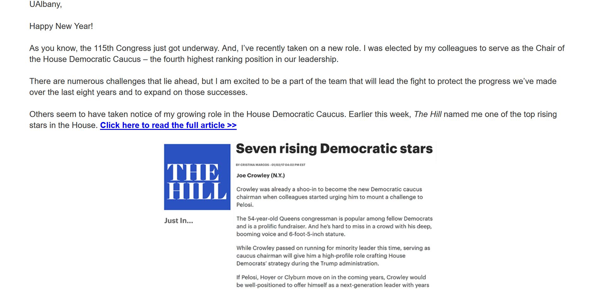
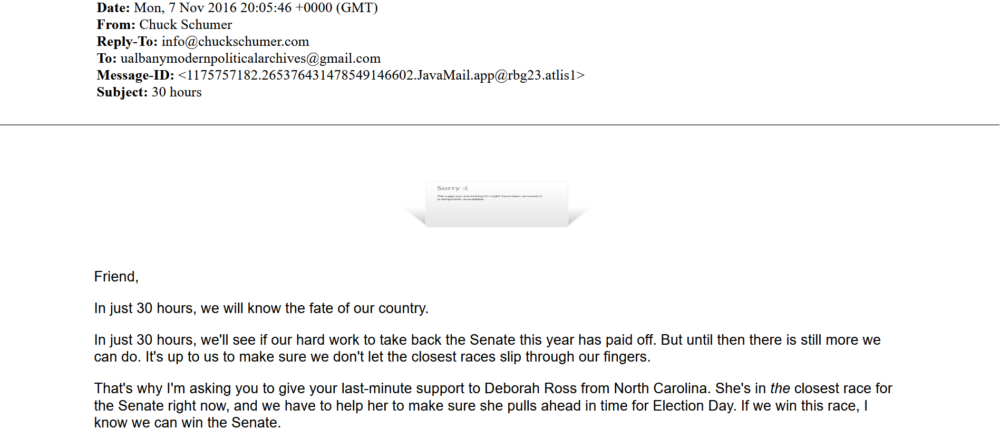
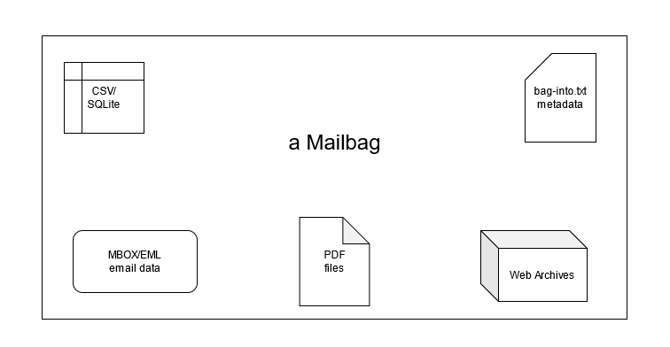

## Mailbag
### A Stable Package for Email with Multiple Masters

[gregwiedeman.com/slides/mailbagCNI.html](https://gregwiedeman.com/slides/mailbagCNI.html)

Gregory Wiedeman 
University Archivist 
University at Albany, SUNY

---

### Email Preservation

* No single master format for email
	* MBOX/EML don't preserve external content
	* PST are similar and proprietary
	* PDFs do not preserve structure
	* Not all emails are static documents
* Not many open source processing tools usable for archivists

---

---

---

## Multiple Master Formats

* MBOX/EML preserves structure as data
* PDF preserves document and allows for easy access
* WARC preserves interactivity

---

## A Stable Package

<ul>
<li>BagIt</li>
  <ul>
  <li>Widely used</li>
  <li>Validates fixity</li>
  <li>Uses filesystem for structure</li>
  </ul>
<li>Interoperable</li>
  <ul>
  <li>ePADD</li>
  <li>RATOM</li>
  </ul>
</ul>

Mailbag Specification
 

---

### Email Processing for Archivists

* Easy packaging near-to-capture
* Existing tools are challenging for archivists
  * Python email libraries
  * Batch PDF creation from email
  * Web Archives capture
* mailbag Python library
* Command Line utility
* Basic GUI with Gooey

---

<!-- .slide: data-background="img/mailbag.png" -->

Note: Diagram of Mailbag, showing inputs from IMAP, MBOX/EML and PST and outputs like reporting header information, exporting PDFs and repaying WARC files.

---

## Mailbag
### A Stable Package for Email with Multiple Masters

[gregwiedeman.com/slides/mailbagCNI.html](https://gregwiedeman.com/slides/mailbagCNI.html)

Gregory Wiedeman 
University Archivist 
University at Albany, SUNY