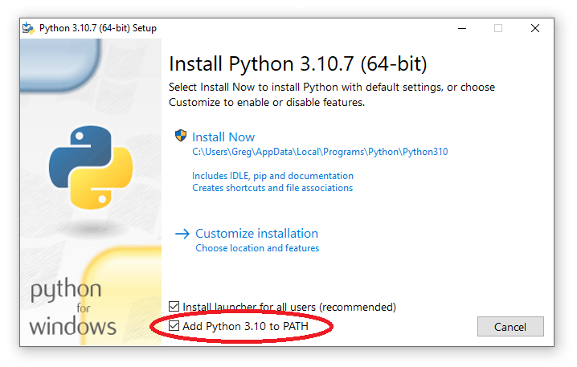
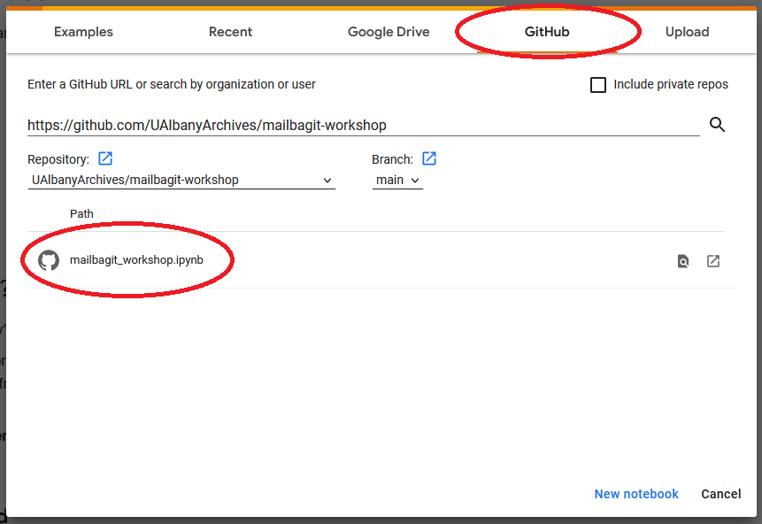

<style>
.fLeft {float: left; max-width: 50%;}
.fRight {float: right; max-width: 50%;}
#smallLink {font-size: 18px;}
.whitebg {background-color: #fff; padding: 30px !important;}
.reveal section img {border: none; background: rgb(255, 255, 255, 1);}
.reveal h1,
.reveal h2,
.reveal h3,
.reveal h4,
.reveal h5,
.reveal h6 {
  font-family: "Montserrat", Roboto , sans-serif;
  text-transform: initial;
  font-weight: bold;
}
.wrap {
position:relative;
  height:30vh;
  border-left:15px solid #000;
  padding:5vh 20px;
}
.arrow {
  position:absolute;
  left:-43px;
  width: 70px;
  bottom: -20px;
}
.up{top:-20px;}
.slide-background-content{background-size:contain!important;}
</style>

## Hands-On Email Preservation with Mailbag

[gregwiedeman.com/slides/mailbagitHandsOn.html](https://gregwiedeman.com/slides/mailbagitHandsOn.html)
[tinyurl.com/mailbagit](https://tinyurl.com/mailbagit-workshop)

Gregory Wiedeman<br/>
University Archivist<br/>
University at Albany, SUNY

---

## The Problem

> "As a very busy archivist, I would like to store this email I have, so that when I return to it later, all the data will be preserved in a structured way."

---

### Email formats are problematic

* MBOX, EML, PST, MSG
  * Preserve email as structured data
  * Missing data/rapidly decay
* PDFs 
  * Preserves email well as a visual document
  * Bad for computational use
* WARC files
  * Preserves visual document experience well
  * Maintains data structure
  * Hard to use/low support for email

---

## What is Mailbag?

* [Mailbag specification](https://archives.albany.edu/mailbag/spec/)
  * extension of Bagit spec
* [Mailbagit tool](https://github.com/UAlbanyArchives/mailbagit)
  * Python utility
  * Very basic GUI
  * Accessible "guided" path

---

## Mailbagit setup

* Python install with pip
  * Some issues on Windows
* Using Windows executables
* [Docker images](https://archives.albany.edu/mailbag/docker/)
* Notebook in Google Colab

---

## Choose your adventure

* Not comfortable with the command line?
  * Use Google Colab notebook
  * Can try Windows exe if admin rights
* MacOS/Linux
  * Any v3.7+ python install or Docker
* Windows
  * Docker/WSL recommended
  * Python v3.7-3.10 (PSTs may not work)
* No Docker? need wkhtmltopdf or Chrome for PDFs

---

## Where are we at?

* Install method?
* OS for Python installs?

---

## mailbagit docker setup

Docker pull may take awhile (552 MB)

```
docker pull ualbanyarchives/mailbagit
wget https://archives.albany.edu/mailbag/docker-compose.yml
docker compose run mailbagit
```

---

## Without docker-compose

```
docker run -it --mount type=bind,source="path/to/data",target=/data ualbanyarchives/mailbagit:latest
docker run -it --mount type=bind,source="C:\Users\Me\path\to\data",target=/data ualbanyarchives/mailbagit:latest
> cd /data
```

---

## Running Windows Executables

* Download them from the [v0.5.0 release on Github](https://github.com/UAlbanyArchives/mailbagit/releases/tag/v0.5.0)
* [Unblock executables from Defender SmartScreen](https://archives.albany.edu/mailbag/exe/#unblocking-mailbagitexe-and-mailbagit-guiexe)


---

## Python & pip install

* [Python v3.7+ installed](https://www.python.org/downloads/)
  * Python v3.7-3.10 on Windows



---

## Python & pip install

* [Python v3.7+ installed](https://www.python.org/downloads/)
  * `python -V` or `python3 -V`
* Do I have pip?

`pip -V` or `pip3 -V`

* If you need pip:

`python -m ensurepip --upgrade`

---

## Python & pip install

* install mailbagit with pip

`pip install mailbagit`

* For non-Windows users

`pip install mailbagit[pst]`

---

## Working with PSTs on Windows

* Visual Studio Installer
  * Community edition works
* Need "Desktop development with C++"
* And "VS 2019 C++ x64/x86 build tools"
* [Docs for this](https://archives.albany.edu/mailbag/python/#working-with-pst-files)

---

## Google Colab Mailbagit setup

* Go to [colab.research.google.com](https://colab.research.google.com/)
* Load from Github
* Enter the Github URL: https://github.com/UAlbanyArchives/mailbagit-workshop
* Select the "mailbagit_workshop.ipynb" notebook

---

## Google Colab Mailbagit setup



---

Check that mailbagit is installed:

`mailbagit -v`

---

## Sample Data

* [https://archives.albany.edu/static/mailbagWorkshopData.zip](https://archives.albany.edu/static/mailbagWorkshopData.zip)
* extract to working directory
  * Inbox (a folder of .EMLs)
  * msgs (a folder of .MSGs)
  * account.mbox
  * enron.pst
* Colab users run "Get some sample data"

---

## What mailbagit does

* Takes email export files
  * PST, MBOX, MSG, EML
  * Single files or directory of files
  * "companion" files option
* Packages them into a mailbag
* Creates derivative files
  * TXT, HTML, EML, MBOX
  * PDF, PDF-chrome, WARC

---

### Speed

* Things that are fast
  * MBOX, EML sources
  * TXT, HTML, EML, MBOX derivatives
* Things that are slow
  * PST, MSG sources
  * PDF, WARC derivatives

---

## CLI Options

* -r --dry-run
* --css path/to/styles.css
* -c --compress zip
* -f --companion_files

---

## CLI Options

* --capture-date
* --capture-agent
* --capture-agent-version
* Most bagit-python options
  * --processes
  * Checksums, --md5, --sha512
  * --source-organization
  * not -quiet, -validate, -fast

---

## Privacy & Security concerns

* [Email trackers](https://archives.albany.edu/mailbag/concerns/#email-trackers)
  * PDF and WARC derivatives ping all URLs
* [File inclusions](https://archives.albany.edu/mailbag/concerns/#file-inclusions-in-pdfs-and-warcs)

---

### Try a "dry run":
```
mailbagit account.mbox -i mbox -d html eml -m test1 -r
```
### Try it for real:
```
mailbagit account.mbox -i mbox -d html eml -m test1
```
---

## What's in a mailbag?

* bagit.txt, manifiests
* bag-info.txt
* mailbag.csv
* data (payload)

---

## bag-info.txt

```
Bag-Size: 34 MB
Bag-Software-Agent: bagit.py v1.8.1 <https://github.com/LibraryOfCongress/bagit-python>
Bag-Type: Mailbag
Bagging-Date: 2022-05-26
Bagging-Timestamp: 2022-05-26T16:15:48
EML-Agent: email
EML-Agent-Version: 3.9.12
External-Identifier: adeb0ab6-59b8-494c-be6a-de066f5c8f23
MSG-Agent: extract_msg
MSG-Agent-Version: 0.30.12
Mailbag-Agent: mailbagit
Mailbag-Agent-Version: 0.2.1
Mailbag-Source: msg
Original-Included: True
PDF-Agent: wkhtmltopdf
PDF-Agent-Version: wkhtmltopdf 0.12.6 (with patched qt)
Payload-Oxum: 36529495.87
WARC-Agent: warcio
WARC-Agent-Version: 1.7.4

```

---

## mailbag.csv headers

```
Error
Mailbag-Message-ID
Message-ID
Original-File
Message-Path
Derivatives-Path
Attachments (int)
Date
From
To
Cc
Bcc
Subject
Content-Type
```

---

## data (payload)

* attachments
  * [Mailbag-Message-ID]
    * attachments.csv
    * test.pdf
* mbox
  * account.mbox
* eml
* html

---

### Try some MSG files

Do a "dry run" first again
```
mailbagit msgs -i msg -d eml html txt -m test2 -r
```

* Dry run still creates an error report
* Take a look a the warnings report in `msgs/test2_warnings`

---

## Mailbagit error reports

* external to mailbag
* created on -r --dry-run
  * more errors will show without dry-run
  * errors from subprocesses
    * wkhtmltopdf
    * chrome
* errors.csv
* .txt file for each message with error and full stack trace

---


### Lets try MSGs for real


```
mailbagit msgs -i msg -d eml html txt -m test2
```

---

## PDFs require external dependencies

* [wkhtmltopdf](https://wkhtmltopdf.org/)
  * `pdf`
* [Google Chrome](https://www.google.com/chrome/) (`chrome`, `chrome.exe`, or `google-chrome`)
  * `pdf-chrome`
* [More setup details](https://archives.albany.edu/mailbag/pdf/)

---

## Add to your PATH Windows

Windows likely paths:
```
C:\Program Files\wkhtmltopdf\bin
C:\Program Files\Google\Chrome\Application
C:\Program Files (x86)\Google\Chrome\Application
```

---

## Add to your PATH MacOS

MacOS likely `/Applications/Google Chrome.app`
```
alias chrome="/Applications/Google\ Chrome.app/Contents/MacOS/Google\ Chrome"
```

---

## Testing PDF commands

```
wkhtmltopdf -V
chrome
chrome.exe
google-chrome
```
---

### Lets make some PDFs

With wkhtmltopdf:
```
mailbagit msgs/ -i msg -d eml pdf -m test3
```
With Chrome:
```
mailbagit msgs/ -i msg -d eml pdf-chrome -m test3
```

---

### Try a PST

```
mailbagit enron.pst -i pst -d eml html mbox -m test4
```

---

### Lets make some WARCs!

```
mailbagit msgs -i msg -d eml html warc -m test5
```

Check out a WARC with [replayweb.page](https://replayweb.page/)!

---

### How mailbagit makes WARCs

* uses [warcio](https://github.com/webrecorder/warcio) and `requests`
* For WARC-Target-URI uses "mailbag", Mailbag-Message-ID
  * "http://mailbag/11/body.html"
* body.html response record
* headers.json response record
* duplicated in metadata record not used by replayweb.page
* includes attachments

---

## How mailbagit handles encoding

* Bodies and headers
* Tries listed encoding if present (and valid)
* Tries chardetect
  * raises warning if successful
  * raises error if failed
* replaces errors with listed encoding
* Writes derivatives as "UTF-8"
  * except EML/MBOX

---

## Lossiness in derivatives

* Most derivatives only contain part of the data
* Most derivatives get written to/from [the mailbagit Model](https://github.com/UAlbanyArchives/mailbagit/blob/main/mailbagit/models.py)
* EML and MBOX derivatives
  * tries to write complete object
  * only possible for EML/MBOX sources
  * uses original encoding
  * sometimes fails due to encoding issues
    * raises warning and generates from Model
    
---

## EML / MBOX from Model

* Contains all headers, HTML and TXT bodies, attachments
* Writes folder structure to X-Folder header
* multipart/mixed
  * multipart/alternative (text/plain if present)
  * multipart/alternative (text/html if present)
  * application/pdf (application/octet-stream if missing)
  
---

## Future Questions

* Packaging from IMAP
* Packaging over APIs
  * Gmail
  * Office365/Exchange
  * would require OAuth
* Exclusions/filtering

---

## Hands-On Email Preservation with Mailbag

[gregwiedeman.com/slides/mailbagitHandsOn.html](hhttps://gregwiedeman.com/slides/mailbagitHandsOn.html)
[tinyurl.com/mailbagit](https://tinyurl.com/mailbagit-workshop)

Gregory Wiedeman<br/>
University Archivist<br/>
University at Albany, SUNY