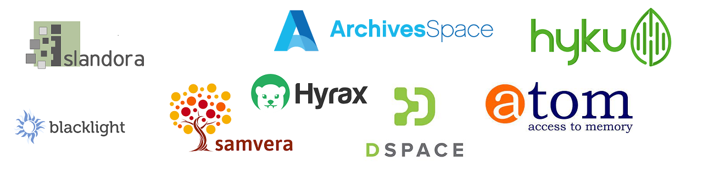
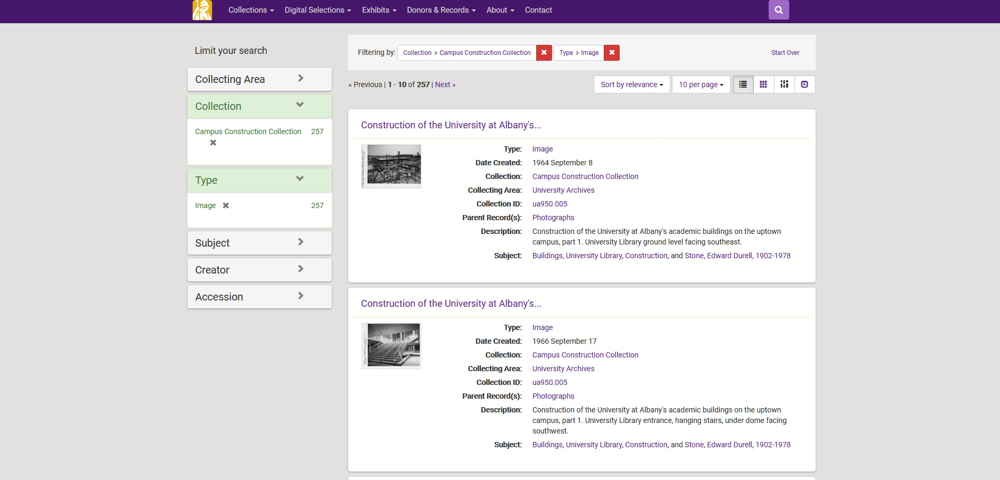

## Systems for Digital Archives

[gregwiedeman.com/slides/milliSessions2021.html](https://gregwiedeman.com/slides/milliSessions2021.html)

Gregory Wiedeman 
University Archivist 
University at Albany, SUNY

---

### Systems for Digital Archives

* No one system
* "Separation of Concerns"

---

### Different Descriptive Systems

* Bibliographic
* Archival

---

### Bibliographic description

* Library catalog
* Traditionally rely on subject analysis
* Search
* Detailed metadata required
	
---

### Archival description

* [ISAD(G)](https://www.ica.org/en/isadg-general-international-standard-archival-description-second-edition)
* [DACS in United States](https://saa-ts-dacs.github.io/dacs/06_part_I/02_chapter_01.html#requirements-for-multilevel-descriptions)
* "finding aids"
* Hierarchical, flexible metadata
* Large volumes

---

### Bibliographic-style metadata

* Digital Asset Management Systems (DAMS)
* Institutional Repositories (IR)
* "Digital Repositories"
* Sometimes framed as preservation

---

---

### Example Open DAMS

* [DSpace](https://duraspace.org/dspace/) (Java)
* [Islandora](https://islandora.ca/) (Drupal)
* [Samvera](https://samvera.org/) (Ruby on Rails)
	* formerly Hydra
	* [Hyrax](https://hyrax.samvera.org/) (customizable)
	* [Hyku](https://hyku.samvera.org/) (strict)

---

### Systems for Archival Description

* Browse and search description
* Display full archival hierarchy
* Describes aggregates
* May link to content
* [Temple University example](https://library.temple.edu/finding_aids)

---

### Systems for Archival Description

* Management & Display
	* [ArchivesSpace](https://archivesspace.org/)
	* [Access to Memory (AtoM)](https://www.accesstomemory.org)
* Display
	* [ArcLight](https://library.stanford.edu/projects/arclight)
	* [Encoded Archival Description (EAD)](https://www2.archivists.org/groups/technical-subcommittee-on-encoded-archival-standards-ts-eas/encoded-archival-description-ead) + XSLT

---

### Archives Display Systems

* [Archives at Yale](https://archives.yale.edu/repositories/resources) (ArchivesSpace)
* [Duke Collection Guides](https://archives.lib.duke.edu/) (ArcLight customized)
* [ArcLight Demo](https://arclight-demo.projectblacklight.org/) (ArcLight default)

---

### Processing Systems

* [Archivematica](https://www.archivematica.org/) for born digital workflows
* [BitCurator](https://bitcurator.net/) tools for disk imaging
* [ePADD](https://library.stanford.edu/projects/epadd) for email processing
* More tools than infrastructure

---

### More Systems!

* Exhibition systems
	* [Omeka](https://omeka.org/)
	* [Spotlight](https://library.stanford.edu/research/spotlight)
* Requests/ticket system
* Payment processing system

---

### Making Connections

	<ul>
		<li>Open APIs</li>
		<li>User Experience (UX) design challenges</li>
		<li><a href="https://archives.lib.duke.edu/?f%5Bhas_online_content_ssim%5D%5B%5D=online&q=&search_field=all_fields">Duke example</a></li>
	</ul>

	

---

## Systems for Digital Archives

[gregwiedeman.com/slides/milliSessions2021.html](https://gregwiedeman.com/slides/milliSessions2021.html)

Gregory Wiedeman 
University Archivist 
University at Albany, SUNY